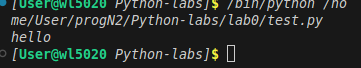

# Отчет
## задание
вывести "Hello"

## описание проделанной работы
- Создали репозиторий для дисциплины на GitHub
- Склонировали его себе на ПК
- Написали программу для вывода слова "Hello"
- Ззапустили её
- Сделали коммит и пуш
## консольные команды
```python
print("hello")
```
## скриншот результата

## список использованных источников:
1.[Справка по markdown](https://doka.guide/tools/markdown/)
2.[Пример отчета](https://github.com/still-coding/report_demo)