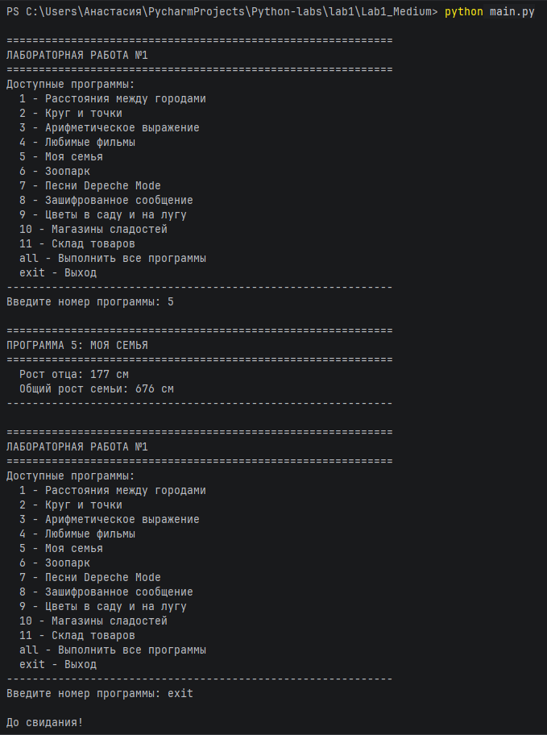

# Отчет по лабораторной работе №1 - medium
## Условие задачи:
Напишите верхнеуровневый модуль, который будет использовать логику из модулей-заданий. Перед этим нужно будет придумать способ инкапсулировать логику для корректного импортирования.
## Описание проделанной работы:
**Требуется:**
- Инкапсулировать логику каждой программы в функции
- Создать верхнеуровневый модуль для управления программами
- Обеспечить возможность выборочного запуска программ

1. Инкапсуляция логики модулей-заданий

Для корректного импортирования была применена следующая стратегия:

- **Каждый файл преобразован в модуль** с набором функций
- **Добавлена конструкция** `if __name__ == "__main__":` для автономного тестирования
- **Функции принимают параметры** и возвращают результаты (вместо прямого вывода через `print()`)
- **Добавлены docstring** для документации функций

**Пример инкапсуляции для `_00_distance.py`:**

```python
def calculate_distance(city1, city2, sites_dict=None):
    """Возвращает расстояние между двумя городами"""
    if sites_dict is None:
        sites_dict = sites
    x1, y1 = sites_dict[city1]
    x2, y2 = sites_dict[city2]
    distance = ((x1 - x2) ** 2 + (y1 - y2) ** 2) ** 0.5
    return round(distance, 2)

def build_distances_matrix(sites_dict=None):
    """Строит полную матрицу расстояний между всеми городами"""
    # ... логика построения матрицы
    return distances

if __name__ == "__main__":
    # Тестовый запуск
    print(build_distances_matrix())
```
Аналогичные преобразования выполнены для всех 11 модулей:
**Аналогичные преобразования выполнены для всех 11 модулей:**

| № | Исходный файл | Основные функции |
|---|---------------|------------------|
| 1 | `_00_distance.py` | `calculate_distance()`, `build_distances_matrix()` |
| 2 | `_01_circle.py` | `calculate_circle_area()`, `is_point_inside_circle()` |
| 3 | `_02_operations.py` | `calculate_expression()` |
| 4 | `_03_favorite_movies.py` | `get_first_movie()`, `get_last_movie()`, `get_second_movie()`, `get_second_from_end()`, `get_all_movies()` |
| 5 | `_04_my_family.py` | `get_father_height()`, `get_total_family_height()` |
| 6 | `_05_zoo.py` | `process_zoo()` |
| 7 | `_06_songs_list.py` | `get_first_three_total()`, `get_second_three_total()` |
| 8 | `_07_secret.py` | `decrypt_message()` |
| 9 | `_08_garden.py` | `get_garden_set()`, `get_meadow_set()`, `get_all_flowers()`, `get_common_flowers()`, `get_only_garden()`, `get_only_meadow()` |
| 10 | `_09_shopping.py` | `get_best_prices()` |
| 11 | `_10_store.py` | `calculate_product_cost()`, `get_all_products_cost()` |
2. Создание верхнеуровневого модуля
Разработан main.py, который:
- Импортирует все 11 модулей с использованием алиасов для удобства
- Реализует интерактивное меню для выбора программы
- Обеспечивает гибкий запуск: отдельные программы или все сразу
- Обрабатывает пользовательский ввод с защитой от неверных значений

Структура верхнеуровневого модуля:
```python
# Импорт всех модулей
import _00_distance as distance
import _01_circle as circle
# ... и так далее для всех 11 модулей

def show_menu():
    """Отображает меню со списком доступных программ"""
    
def run_program(choice):
    """Запускает выбранную программу"""
    
def main():
    """Главная функция с циклом обработки команд"""
    
if __name__ == "__main__":
    main()
```
Структура проекта: 
lab1/
├── _00_distance.py          # Модуль 1: расстояния между городами

├── _01_circle.py            # Модуль 2: круг и точки

├── _02_operations.py        # Модуль 3: арифметическое выражение

├── _03_favorite_movies.py   # Модуль 4: любимые фильмы

├── _04_my_family.py         # Модуль 5: моя семья

├── _05_zoo.py               # Модуль 6: зоопарк

├── _06_songs_list.py        # Модуль 7: песни Depeche Mode

├── _07_secret.py            # Модуль 8: зашифрованное сообщение

├── _08_garden.py            # Модуль 9: цветы

├── _09_shopping.py          # Модуль 10: магазины сладостей

├── _10_store.py             # Модуль 11: склад товаров

└── main.py                  # Верхнеуровневый модуль

Инструкция по запуску:
- Сохранить все файлы в одной папке
- Открыть терминал/командную строку
- Перейти в папку с проектом
- Выполнить команду:
```python
python main.py
```
## Программа:
```python
#!/usr/bin/env python3
# -*- coding: utf-8 -*-

"""
Верхнеуровневый модуль для лабораторной работы №1
Интерактивный режим: вывод только выбранных программ
"""

import distance
import circle
import operations
import favorite_movies
import my_family
import zoo
import songs_list
import secret
import garden
import shopping
import store


def show_menu():
    """Показывает меню со списком программ"""
    print("\n" + "=" * 60)
    print("ЛАБОРАТОРНАЯ РАБОТА №1")
    print("=" * 60)
    print("Доступные программы:")
    print("  1 - Расстояния между городами")
    print("  2 - Круг и точки")
    print("  3 - Арифметическое выражение")
    print("  4 - Любимые фильмы")
    print("  5 - Моя семья")
    print("  6 - Зоопарк")
    print("  7 - Песни Depeche Mode")
    print("  8 - Зашифрованное сообщение")
    print("  9 - Цветы в саду и на лугу")
    print("  10 - Магазины сладостей")
    print("  11 - Склад товаров")
    print("  all - Выполнить все программы")
    print("  exit - Выход")
    print("-" * 60)


def run_program(choice):
    """Запускает выбранную программу"""

    if choice == "1":
        print("\n" + "=" * 60)
        print("ПРОГРАММА 1: РАССТОЯНИЯ МЕЖДУ ГОРОДАМИ")
        print("=" * 60)
        distances = distance.build_distances_matrix()
        for city, destinations in distances.items():
            for dest, dist in destinations.items():
                print(f"  {city} → {dest}: {dist}")
        print("-" * 60)

    elif choice == "2":
        print("\n" + "=" * 60)
        print("ПРОГРАММА 2: КРУГ И ТОЧКИ")
        print("=" * 60)
        radius = 42
        print(f"  Площадь круга (r={radius}): {circle.calculate_circle_area(radius)}")
        point1, point2 = (23, 34), (30, 30)
        print(f"  Точка {point1} внутри круга: {circle.is_point_inside_circle(point1, radius)}")
        print(f"  Точка {point2} внутри круга: {circle.is_point_inside_circle(point2, radius)}")
        print("-" * 60)

    elif choice == "3":
        print("\n" + "=" * 60)
        print("ПРОГРАММА 3: АРИФМЕТИЧЕСКОЕ ВЫРАЖЕНИЕ")
        print("=" * 60)
        print(f"  (1*2+3)*4+5 = {operations.calculate_expression()}")
        print("-" * 60)

    elif choice == "4":
        print("\n" + "=" * 60)
        print("ПРОГРАММА 4: ЛЮБИМЫЕ ФИЛЬМЫ")
        print("=" * 60)
        movies = favorite_movies.get_all_movies()
        print(f"  Первый фильм: {movies['first']}")
        print(f"  Второй фильм: {movies['second']}")
        print(f"  Второй с конца: {movies['second_from_end']}")
        print(f"  Последний фильм: {movies['last']}")
        print("-" * 60)

    elif choice == "5":
        print("\n" + "=" * 60)
        print("ПРОГРАММА 5: МОЯ СЕМЬЯ")
        print("=" * 60)
        print(f"  Рост отца: {my_family.get_father_height()} см")
        print(f"  Общий рост семьи: {my_family.get_total_family_height()} см")
        print("-" * 60)

    elif choice == "6":
        print("\n" + "=" * 60)
        print("ПРОГРАММА 6: ЗООПАРК")
        print("=" * 60)
        zoo_result = zoo.process_zoo()
        print(f"  Финальный список животных: {zoo_result['final_zoo']}")
        print(f"  Лев в клетке №{zoo_result['lion_position']}")
        print(f"  Жаворонок в клетке №{zoo_result['lark_position']}")
        print("-" * 60)

    elif choice == "7":
        print("\n" + "=" * 60)
        print("ПРОГРАММА 7: ПЕСНИ DEPECHE MODE")
        print("=" * 60)
        print(f"  Три песни звучат: {songs_list.get_first_three_total()} минут")
        print(f"  А другие три песни звучат: {songs_list.get_second_three_total()} минут")
        print("-" * 60)

    elif choice == "8":
        print("\n" + "=" * 60)
        print("ПРОГРАММА 8: ЗАШИФРОВАННОЕ СООБЩЕНИЕ")
        print("=" * 60)
        print(f"  Расшифрованное сообщение: {secret.decrypt_message()}")
        print("-" * 60)

    elif choice == "9":
        print("\n" + "=" * 60)
        print("ПРОГРАММА 9: ЦВЕТЫ В САДУ И НА ЛУГУ")
        print("=" * 60)
        print(f"  Все цветы: {garden.get_all_flowers()}")
        print(f"  Цветы, растущие и там, и там: {garden.get_common_flowers()}")
        print(f"  Цветы только в саду: {garden.get_only_garden()}")
        print(f"  Цветы только на лугу: {garden.get_only_meadow()}")
        print("-" * 60)

    elif choice == "10":
        print("\n" + "=" * 60)
        print("ПРОГРАММА 10: МАГАЗИНЫ СЛАДОСТЕЙ")
        print("=" * 60)
        best_prices = shopping.get_best_prices()
        for product, shops_list in best_prices.items():
            print(f"  {product}:")
            for shop_info in shops_list:
                print(f"    - {shop_info['shop']}: {shop_info['price']} руб")
        print("-" * 60)

    elif choice == "11":
        print("\n" + "=" * 60)
        print("ПРОГРАММА 11: СКЛАД ТОВАРОВ")
        print("=" * 60)
        all_products = store.get_all_products_cost()
        for product, data in all_products.items():
            print(f"  {product}: {data['quantity']} шт, стоимость {data['cost']} руб")
        print("-" * 60)

    elif choice == "all":
        print("\n" + "=" * 60)
        print("ВЫПОЛНЕНИЕ ВСЕХ ПРОГРАММ")
        print("=" * 60)
        for i in range(1, 12):
            run_program(str(i))

    elif choice == "exit":
        print("\nДо свидания!")
        return False

    else:
        print("\nНеверный выбор! Пожалуйста, введите номер программы (1-11), 'all' или 'exit'")

    return True


def main():
    """Главная функция программы"""
    while True:
        show_menu()
        user_choice = input("Введите номер программы: ").strip().lower()

        if not run_program(user_choice):
            break


if __name__ == "__main__":
    main()
```
## Вывод:
