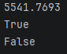

# Отчет
## Задание 1 - distance.py
## 1. Описание проделанной работы:
Есть словарь координат городов.
```питон
sites = {
    'Moscow': (550, 370),
    'London': (510, 510),
    'Paris': (480, 480),
}
```
Нам нужно составить словарь словарей расстояний между ними

Для этого используем формулу расстояния на координатной сетке
$$d=((x1 - x2) ** 2 + (y1 - y2) ** 2) ** 0.5$$
## 2. Программа
```питон
sites = {
    'Moscow': (550, 370),
    'London': (510, 510),
    'Paris': (480, 480),
}

distances = {}

Moscow_distances_London = round(((sites['Moscow'][0] - sites['London'][0]) ** 2 + (sites['Moscow'][1] - sites['London'][1]) ** 2) ** 0.5, 2)
Moscow_distances_Paris = round(((sites['Moscow'][0] - sites['Paris'][0]) ** 2 + (sites['Moscow'][1] - sites['Paris'][1]) ** 2) ** 0.5, 2)

London_distances_Moscow = round(((sites['London'][0] - sites['Moscow'][0]) ** 2 + (sites['London'][1] - sites['Moscow'][1]) ** 2) ** 0.5, 2)
London_distances_Paris = round(((sites['London'][0] - sites['Paris'][0]) ** 2 + (sites['London'][1] - sites['Paris'][1]) ** 2) ** 0.5, 2)

Paris_distances_Moscow = round(((sites['Paris'][0] - sites['Moscow'][0]) ** 2 + (sites['Paris'][1] - sites['Moscow'][1]) ** 2) ** 0.5, 2)
Paris_distances_London = round(((sites['Paris'][0] - sites['London'][0]) ** 2 + (sites['Paris'][1] - sites['London'][1]) ** 2) ** 0.5, 2)

distances['Moscow'] = {
    'London': Moscow_distances_London,
    'Paris': Moscow_distances_Paris,
}

distances['London'] = {
    'Moscow': London_distances_Moscow,
    'Paris': London_distances_Paris
}

distances['Paris'] = {
    'London': Paris_distances_London,
    'Moscow': Paris_distances_Moscow
}

print(distances)
```
## 3. Вывод


---

## Задание 2 - circle.py
## 1. Описание проделанной работы:
Есть значение радиуса круга
```commandline
radius = 42
```
Нужно ввести на консоль значение площади этого круга с точностью до 4-х знаков после запятой

Далее, пусть есть координаты точки
```commandline
point_1 = (23, 34)
```
Если точка point лежит внутри того самого круга [центр в начале координат (0, 0), radius = 42],
то выведите на консоль True, Или False, если точка лежит вовне круга. 

И аналогично для другой точки
```commandline
point_2 = (30, 30)
```
## 2. Программа
```питон
radius = 42

pi = 3.1415926
S = round(pi * radius ** 2, 4)
print(S)

point_1 = (23, 34)

d = (23 ** 2 + 34 ** 2) ** 0.5
if d <= radius:
    print(True)
else:
    print(False)

point_2 = (30, 30)

d = (30 ** 2 + 30 ** 2) ** 0.5
if d <= radius:
    print(True)
else:
    print(False)
```
## 3. Вывод


---

## Задание 3 - operations.py
## 1. Описание проделанной работы:
Расставила знаки операций "плюс", "минус", "умножение" и скобки
между числами "1 2 3 4 5" так, что бы получилось число "25" и вывела результат на консоль.
## 2. Программа
```питон
My_result = (1 * 2 + 3) * 4 + 5
print(My_result)
```
## 3. Вывод


---

