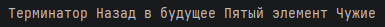
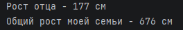
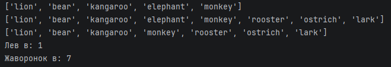
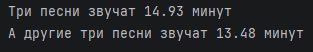
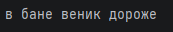
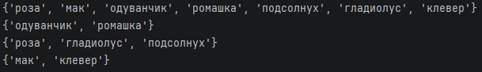
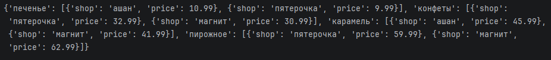
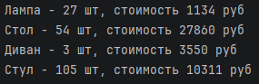

# Отчет
## Задание 1 - distance.py
## 1. Описание проделанной работы:
Есть словарь координат городов.
```питон
sites = {
    'Moscow': (550, 370),
    'London': (510, 510),
    'Paris': (480, 480),
}
```
Нам нужно составить словарь словарей расстояний между ними

Для этого используем формулу расстояния на координатной сетке
$$d=((x1 - x2) ** 2 + (y1 - y2) ** 2) ** 0.5$$
## 2. Программа
```питон
sites = {
    'Moscow': (550, 370),
    'London': (510, 510),
    'Paris': (480, 480),
}

distances = {}

Moscow_distances_London = round(((sites['Moscow'][0] - sites['London'][0]) ** 2 + (sites['Moscow'][1] - sites['London'][1]) ** 2) ** 0.5, 2)
Moscow_distances_Paris = round(((sites['Moscow'][0] - sites['Paris'][0]) ** 2 + (sites['Moscow'][1] - sites['Paris'][1]) ** 2) ** 0.5, 2)

London_distances_Moscow = round(((sites['London'][0] - sites['Moscow'][0]) ** 2 + (sites['London'][1] - sites['Moscow'][1]) ** 2) ** 0.5, 2)
London_distances_Paris = round(((sites['London'][0] - sites['Paris'][0]) ** 2 + (sites['London'][1] - sites['Paris'][1]) ** 2) ** 0.5, 2)

Paris_distances_Moscow = round(((sites['Paris'][0] - sites['Moscow'][0]) ** 2 + (sites['Paris'][1] - sites['Moscow'][1]) ** 2) ** 0.5, 2)
Paris_distances_London = round(((sites['Paris'][0] - sites['London'][0]) ** 2 + (sites['Paris'][1] - sites['London'][1]) ** 2) ** 0.5, 2)

distances['Moscow'] = {
    'London': Moscow_distances_London,
    'Paris': Moscow_distances_Paris,
}

distances['London'] = {
    'Moscow': London_distances_Moscow,
    'Paris': London_distances_Paris
}

distances['Paris'] = {
    'London': Paris_distances_London,
    'Moscow': Paris_distances_Moscow
}

print(distances)
```
## 3. Вывод


---

## Задание 2 - circle.py
## 1. Описание проделанной работы:
Есть значение радиуса круга
```commandline
radius = 42
```
Нужно ввести на консоль значение площади этого круга с точностью до 4-х знаков после запятой

Далее, пусть есть координаты точки
```commandline
point_1 = (23, 34)
```
Если точка point лежит внутри того самого круга [центр в начале координат (0, 0), radius = 42],
то выведите на консоль True, Или False, если точка лежит вовне круга. 

И аналогично для другой точки
```commandline
point_2 = (30, 30)
```
## 2. Программа
```питон
radius = 42

pi = 3.1415926
S = round(pi * radius ** 2, 4)
print(S)

point_1 = (23, 34)

d = (23 ** 2 + 34 ** 2) ** 0.5
if d <= radius:
    print(True)
else:
    print(False)

point_2 = (30, 30)

d = (30 ** 2 + 30 ** 2) ** 0.5
if d <= radius:
    print(True)
else:
    print(False)
```
## 3. Вывод


---

## Задание 3 - operations.py
## 1. Описание проделанной работы:
Расставила знаки операций "плюс", "минус", "умножение" и скобки
между числами "1 2 3 4 5" так, что бы получилось число "25" и вывела результат на консоль.
## 2. Программа
```питон
My_result = (1 * 2 + 3) * 4 + 5
print(My_result)
```
## 3. Вывод


---

## Задание 4 - favorite_movies.py
## 1. Описание проделанной работы:
Есть строка с перечислением фильмов
```commandline
my_favorite_movies = 'Терминатор, Пятый элемент, Аватар, Чужие, Назад в будущее'
```
Требуется ввести на консоль с помощью индексации строки, последовательно:
- первый фильм
- последний
- второй
- второй с конца
## 2. Программа
```питон
my_favorite_movies = 'Терминатор, Пятый элемент, Аватар, Чужие, Назад в будущее'
print(my_favorite_movies[:10], my_favorite_movies[42:63], my_favorite_movies[12:25], my_favorite_movies[35:40])
```
## 3. Вывод


---

## Задание 5 - my_family.py
## 1. Описание проделанной работы:
Создала
- списки состоящие из имен моей семьи (минимум 3 элемента)
- список списков приблизителного роста членов вашей семьи

Вывела на консоль рост отца и общий рост вашей семьи как сумму ростов всех членов
## 2. Программа
```питон
my_family = ['Lyudmila', 'Denis', 'Nastya', 'Sergey']

my_family_height = [
    ['Lyudmila', 162],
    ['Denis', 177],
    ['Nastya', 160],
    ['Sergey', 177]
]

print(f'Рост отца - {my_family_height[3][1]} см')

total_height = 0
for person in my_family_height:
    total_height = total_height + person[1]

print(f"Общий рост моей семьи - {total_height} см")
```
## 3. Вывод


---

## Задание 6 - zoo.py
## 1. Описание проделанной работы:
Есть список животных в зоопарке
```commandline
zoo = ['lion', 'kangaroo', 'elephant', 'monkey', ]
```
нужно:
- посадить медведя (bear) между львом и кенгуру
- добавьть птиц из списка birds в последние клетки зоопарка
- убрать слона
- вывести на консоль в какой клетке сидит лев (lion) и жаворонок (lark).

## 2. Программа
```питон
zoo = ['lion', 'kangaroo', 'elephant', 'monkey', ]

zoo.insert(1, 'bear')
print(zoo)

birds = ['rooster', 'ostrich', 'lark', ]
zoo.extend(birds)
print(zoo)

zoo.remove('elephant')
print(zoo)

lion_index = zoo.index('lion')
lark_index = zoo.index('lark')

print(f'Лев в: {lion_index + 1}')
print(f'Жаворонок в: {lark_index + 1}')
```
## 3. Вывод


---

## Задание 7 - songs_list.py
## 1. Описание проделанной работы:
Есть список песен группы Depeche Mode со временем звучания с точностью до долей минут
```commandline
violator_songs_list = [
    ['World in My Eyes', 4.86],
    ['Sweetest Perfection', 4.43],
    ['Personal Jesus', 4.56],
    ['Halo', 4.9],
    ['Waiting for the Night', 6.07],
    ['Enjoy the Silence', 4.20],
    ['Policy of Truth', 4.76],
    ['Blue Dress', 4.29],
    ['Clean', 5.83],
]
```
Нужно распечатать общее время звучания трех песен: 'Halo', 'Enjoy the Silence' и 'Clean' в формате:
три песни звучат ХХХ.XX минут

Также сть словарь песен группы Depeche Mode
```commandline
violator_songs_dict = {
    'World in My Eyes': 4.76,
    'Sweetest Perfection': 4.43,
    'Personal Jesus': 4.56,
    'Halo': 4.30,
    'Waiting for the Night': 6.07,
    'Enjoy the Silence': 4.6,
    'Policy of Truth': 4.88,
    'Blue Dress': 4.18,
    'Clean': 5.68,
}
```
из этого списка нужно распечатать общее время звучания трех песен: 'Sweetest Perfection', 'Policy of Truth' и 'Blue Dress'
## 2. Программа
```питон
violator_songs_list = [
    ['World in My Eyes', 4.86],
    ['Sweetest Perfection', 4.43],
    ['Personal Jesus', 4.56],
    ['Halo', 4.9],
    ['Waiting for the Night', 6.07],
    ['Enjoy the Silence', 4.20],
    ['Policy of Truth', 4.76],
    ['Blue Dress', 4.29],
    ['Clean', 5.83],
]

halo_time = violator_songs_list[3][1]
enjoy_time = violator_songs_list[5][1]
clean_time = violator_songs_list[8][1]

total_time = halo_time + enjoy_time + clean_time

total_time_rounded = round(total_time, 2)

print(f"Три песни звучат {total_time_rounded} минут")

violator_songs_dict = {
    'World in My Eyes': 4.76,
    'Sweetest Perfection': 4.43,
    'Personal Jesus': 4.56,
    'Halo': 4.30,
    'Waiting for the Night': 6.07,
    'Enjoy the Silence': 4.6,
    'Policy of Truth': 4.88,
    'Blue Dress': 4.18,
    'Clean': 5.68,
}

Sweetest_Perfection_time = violator_songs_list[1][1]
Policy_of_Truth_time = violator_songs_list[6][1]
Blue_Dress_time = violator_songs_list[7][1]

total_time_2 = Sweetest_Perfection_time + Policy_of_Truth_time + Blue_Dress_time

total_time_rounded_2 = round(total_time_2, 2)

print(f"А другие три песни звучат {total_time_rounded_2} минут")
```
## 3. Вывод


---

## Задание 8 - secret.py
## 1. Описание проделанной работы:
Есть зашифрованное сообщение
```commandline
secret_message = [
    'квевтфпп6щ3стмзалтнмаршгб5длгуча',
    'дьсеы6лц2бане4т64ь4б3ущея6втщл6б',
    'т3пплвце1н3и2кд4лы12чф1ап3бкычаь',
    'ьд5фму3ежородт9г686буиимыкучшсал',
    'бсц59мегщ2лятьаьгенедыв9фк9ехб1а',
]
```
Нужно его расшифровать и вывести на консоль в удобочитаемом виде.

Ключ к расшифровке:
- первое слово - 4-я буква
- второе слово - буквы с 10 по 13, включительно
- третье слово - буквы с 6 по 15, включительно, через одну
- четвертое слово - буквы с 8 по 13, включительно, в обратном порядке
- пятое слово - буквы с 17 по 21, включительно, в обратном порядке
## 2. Программа
```питон
secret_message = [
    'квевтфпп6щ3стмзалтнмаршгб5длгуча',
    'дьсеы6лц2бане4т64ь4б3ущея6втщл6б',
    'т3пплвце1н3и2кд4лы12чф1ап3бкычаь',
    'ьд5фму3ежородт9г686буиимыкучшсал',
    'бсц59мегщ2лятьаьгенедыв9фк9ехб1а',
]

first_word = secret_message[0][3]
second_word = secret_message[1][9:13]
third_word = secret_message[2][5:15:2]
fourth_word = secret_message[3][12:6:-1]
fifth_word = secret_message[4][20:15]

secret_message = f'{first_word} {second_word} {third_word} {fourth_word} {fifth_word}'
print(secret_message)
```
## 3. Вывод


---

## Задание 9 - garden.py
## 1. Описание проделанной работы:
Даны два множества цветов, одни растут в саду, другие на лугу 
```commandline
garden = ('ромашка', 'роза', 'одуванчик', 'ромашка', 'гладиолус', 'подсолнух', 'роза', )
meadow = ('клевер', 'одуванчик', 'ромашка', 'клевер', 'мак', 'одуванчик', 'ромашка', )
```
Нужно создать множество цветов, произрастающих в саду и на лугу и вывести на консоль:
- все виды цветов
- те, которые растут и там и там
- те, которые растут в саду, но не растут на лугу
- те, которые растут на лугу, но не растут в саду
## 2. Программа
```питон
garden = ('ромашка', 'роза', 'одуванчик', 'ромашка', 'гладиолус', 'подсолнух', 'роза', )
meadow = ('клевер', 'одуванчик', 'ромашка', 'клевер', 'мак', 'одуванчик', 'ромашка', )

garden_set = set(garden)
meadow_set = set(meadow)

flower_set = set.union(garden_set,meadow_set)
print(flower_set)

flower_set = garden_set & meadow_set
print(flower_set)

flower_set = garden_set - meadow_set
print(flower_set)

flower_set = meadow_set - garden_set
print(flower_set)
```
## 3. Вывод


---

## Задание 10 - shopping.py
## 1. Описание проделанной работы:
Есть словарь магазинов с распродажами
```commandline
shops = {
    'ашан':
        [
            {'name': 'печенье', 'price': 10.99},
            {'name': 'конфеты', 'price': 34.99},
            {'name': 'карамель', 'price': 45.99},
            {'name': 'пирожное', 'price': 67.99}
        ],
    'пятерочка':
        [
            {'name': 'печенье', 'price': 9.99},
            {'name': 'конфеты', 'price': 32.99},
            {'name': 'карамель', 'price': 46.99},
            {'name': 'пирожное', 'price': 59.99}
        ],
    'магнит':
        [
            {'name': 'печенье', 'price': 11.99},
            {'name': 'конфеты', 'price': 30.99},
            {'name': 'карамель', 'price': 41.99},
            {'name': 'пирожное', 'price': 62.99}
        ],
}
```
Нужно создать словарь цен на продукты
## 2. Программа
```питон
shops = {
    'ашан':
        [
            {'name': 'печенье', 'price': 10.99},
            {'name': 'конфеты', 'price': 34.99},
            {'name': 'карамель', 'price': 45.99},
            {'name': 'пирожное', 'price': 67.99}
        ],
    'пятерочка':
        [
            {'name': 'печенье', 'price': 9.99},
            {'name': 'конфеты', 'price': 32.99},
            {'name': 'карамель', 'price': 46.99},
            {'name': 'пирожное', 'price': 59.99}
        ],
    'магнит':
        [
            {'name': 'печенье', 'price': 11.99},
            {'name': 'конфеты', 'price': 30.99},
            {'name': 'карамель', 'price': 41.99},
            {'name': 'пирожное', 'price': 62.99}
        ],
}

sweets = {
    'печенье': [
        {'shop': 'ашан', 'price': 10.99},
        {'shop': 'пятерочка', 'price': 9.99},
    ],
    'конфеты': [
        {'shop': 'пятерочка', 'price': 32.99},
        {'shop': 'магнит', 'price': 30.99},
    ],
    'карамель': [
        {'shop': 'ашан', 'price': 45.99},
        {'shop': 'магнит', 'price': 41.99},
    ],
    'пирожное': [
        {'shop': 'пятерочка', 'price': 59.99},
        {'shop': 'магнит', 'price': 62.99},
    ],
}
print(sweets)
```
## 3. Вывод


---

## Задание 11 - store.py
## 1. Описание проделанной работы:
Есть словарь кодов товаров
```
goods = {
    'Лампа': '12345',
    'Стол': '23456',
    'Диван': '34567',
    'Стул': '45678',
}
```
Есть словарь списков количества товаров на складе.
```
store = {
    '12345': [
        {'quantity': 27, 'price': 42},
    ],
    '23456': [
        {'quantity': 22, 'price': 510},
        {'quantity': 32, 'price': 520},
    ],
    '34567': [
        {'quantity': 2, 'price': 1200},
        {'quantity': 1, 'price': 1150},
    ],
    '45678': [
        {'quantity': 50, 'price': 100},
        {'quantity': 12, 'price': 95},
        {'quantity': 43, 'price': 97},
    ],
}
```
Нужно рассчитать на какую сумму лежит каждого товара на складе

Вывести стоимость каждого вида товара на складе и сколько штук
## 2. Программа
```питон
goods = {
    'Лампа': '12345',
    'Стол': '23456',
    'Диван': '34567',
    'Стул': '45678',
}

store = {
    '12345': [
        {'quantity': 27, 'price': 42},
    ],
    '23456': [
        {'quantity': 22, 'price': 510},
        {'quantity': 32, 'price': 520},
    ],
    '34567': [
        {'quantity': 2, 'price': 1200},
        {'quantity': 1, 'price': 1150},
    ],
    '45678': [
        {'quantity': 50, 'price': 100},
        {'quantity': 12, 'price': 95},
        {'quantity': 43, 'price': 97},
    ],
}

lamp_code = goods['Лампа']

lamps_item = store[lamp_code][0]
lamps_quantity = lamps_item['quantity']
lamps_price = lamps_item['price']
lamps_cost = lamps_quantity * lamps_price
print('Лампа -', lamps_quantity, 'шт, стоимость', lamps_cost, 'руб')

table_code = goods['Стол']

table1_quantity = store[table_code][0]['quantity']
table1_price = store[table_code][0]['price']
table1_cost = table1_quantity * table1_price

table2_quantity = store[table_code][1]['quantity']
table2_price = store[table_code][1]['price']
table2_cost = table2_quantity * table2_price

table_total_quantity = table1_quantity + table2_quantity
table_total_cost = table1_cost + table2_cost
print(f'Стол - {table_total_quantity} шт, стоимость {table_total_cost} руб')

divan_code = goods['Диван']

divan1_quantity = store[divan_code][0]['quantity']
divan1_price = store[divan_code][0]['price']
divan1_cost = divan1_quantity * divan1_price

divan2_quantity = store[divan_code][1]['quantity']
divan2_price = store[divan_code][1]['price']
divan2_cost = divan2_quantity * divan2_price

divan_total_quantity = divan1_quantity + divan2_quantity
divan_total_cost = divan1_cost + divan2_cost
print(f'Диван - {divan_total_quantity} шт, стоимость {divan_total_cost} руб')

stul_code = goods['Стул']

stul1_quantity = store[stul_code][0]['quantity']
stul1_price = store[stul_code][0]['price']
stul1_cost = stul1_quantity * stul1_price

stul2_quantity = store[stul_code][1]['quantity']
stul2_price = store[stul_code][1]['price']
stul2_cost = stul2_quantity * stul2_price

stul3_quantity = store[stul_code][2]['quantity']
stul3_price = store[stul_code][2]['price']
stul3_cost = stul3_quantity * stul3_price

stul_total_quantity = stul1_quantity + stul2_quantity + stul3_quantity
stul_total_cost = stul1_cost + stul2_cost + stul3_cost
print(f'Стул - {stul_total_quantity} шт, стоимость {stul_total_cost} руб')
```
## 3. Вывод


---