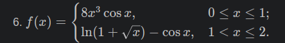
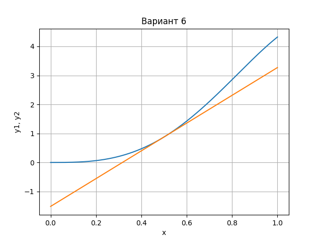

## Задание: построение графиков в Python
## 1. Описание проделанной работы:
1. Импортировала библиотеки matplotlib и numpy
2. изучила уроки по построению графика
3. создала график:
 на промежутке 0<=x<=1 и касательную с нему в точке x=0,5
## 2. Программа
```python
import matplotlib.pyplot as plt
import numpy as np
import math
x = np.linspace(0,1,500)
y1 = 8 * x**3 * np.cos(x)
y2 = 4.786 * x - 1.515
plt.title('Вариант 6') # заголовок
plt.xlabel('x') # ось абсцисс
plt.ylabel('y1, y2') # ось ординат
plt.grid() # включение отображение сетки
plt.plot(x,y1, x,y2)
plt.show()
```
## 3. Вывод

## Использованные источники:
[Devpractice Team. Библиотека Matplotlib](https://evil-teacher.orbiter.website/books/prog_pm/matplotlib.pdf)