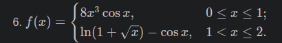
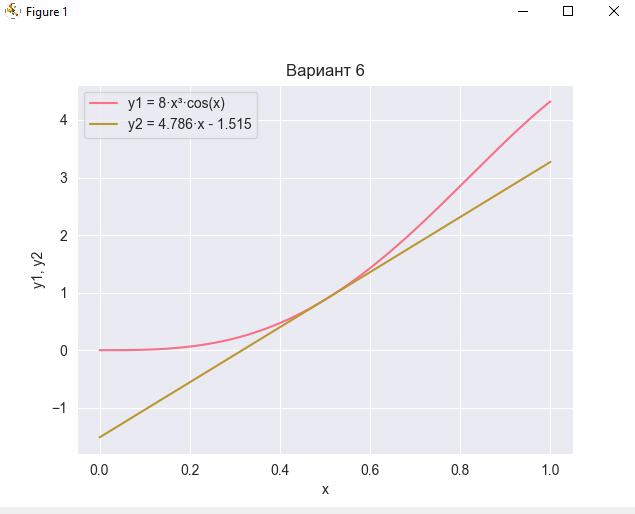

# Отчет по лабораторной работе №2 - medium
## Условие задачи:
Постройте все графики с использованием seaborn вместо matplotlib
## Описание проделанной работы:
1. Импортировала библиотеки seaborn и numpy
2. изучила уроки по построению графика
3. создала график:
 на промежутке 0<=x<=1 и касательную с нему в точке x=0,5
## 2. Программа
```python
import seaborn as sns
import numpy as np
from matplotlib import pyplot as plt  # импорт, но не как pyplot

sns.set_style("darkgrid")
sns.set_palette("husl")

x = np.linspace(0, 1, 500)
y1 = 8 * x**3 * np.cos(x)
y2 = 4.786 * x - 1.515

sns.lineplot(x=x, y=y1, label='y1 = 8·x³·cos(x)')
sns.lineplot(x=x, y=y2, label='y2 = 4.786·x - 1.515')

plt.title('Вариант 6')
plt.xlabel('x')
plt.ylabel('y1, y2')
plt.legend()
plt.show()
```
## 3. Вывод


