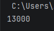
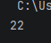
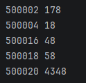

# Вариант 6
## Задание 1
## 1. Условия задачи
Ученица составляет 5-буквенные слова из букв ГЕПАРД. При этом в каждом слове ровно одна буква Г, слово не может начинаться на букву А и заканчиваться буквой Е. Какое количество слов может составить ученица?
## 2. Описание проделанной работы:
Сначала импортировали функцию product из модуля itertools. далее задаем кортеж и ставим счетчик. затем перебираем все возможные последовательности длиной 6. в конце функция возвращает итоговое значение и выводит на экран.
## 3. Программа
```питон
rom itertools import product
def count_combo():
    letters = ('Г', 'Е', 'П', 'А', 'Р', 'Д')
    count = 0
    for combo in product(letters, repeat = 6):
        word = list(combo)
        if word.count('Г') == 1 and word[0] != 'А' and word[4] != 'Е':
            count += 1
    return count
result = count_combo()
print(result)
```
## 4. Вывод


---

## Задание 2
## 1. Условия задачи
Значение выражения 
5^36 + 5^24 − 25 записали в системе счисления с основанием 5. Сколько цифр 4 содержится в этой записи?
## 2. Описание проделанной работы:
Сначала вычисляем выражение, затем переводим функцией перевода в 5-ричную систему и считаем цифры. Последнее выводит результат
## 3. Программа
```python
s = 5**36 + 5**24 - 25
def count_combo():
    count = 0
    n = s
    while n > 0:
        if n % 5 == 4:
            count += 1
        n = n // 5
    return count
result = count_combo()
print(result)

```
## 4. Вывод


---

## Задание 3
## 1. Условия задачи
Найдите 5 чисел больших 500000, таких, что среди их делителей есть число, оканчивающееся на 8, при этом этот делитель не равен 8 и самому числу. В качестве ответа приведите 5 наименьших чисел, соответствующих условию.
## 2. Описание проделанной работы:
Сначала через цикл ищем цифру, затем делители текущего числа, после проверка и сохранение результата и вывод.
## 3. Программа
```python
def find_numbers_with_divisor_ending_8():
    results = []
    num = 500001
    
    while len(results) < 5:
        divisors_ending_8 = []
        
        for i in range(1, int(num**0.5) + 1):
            if num % i == 0:
                if i % 10 == 8 and i != 8 and i != num:
                    divisors_ending_8.append(i)
                j = num // i
                if j != i and j % 10 == 8 and j != 8 and j != num:
                    divisors_ending_8.append(j)
        
        if divisors_ending_8:
            min_divisor = min(divisors_ending_8)
            results.append((num, min_divisor))
        
        num += 1
    
    return results

if __name__ == "__main__":
    numbers = find_numbers_with_divisor_ending_8()
    for number, divisor in numbers:
        print(number, divisor)
```
## 4. Вывод

