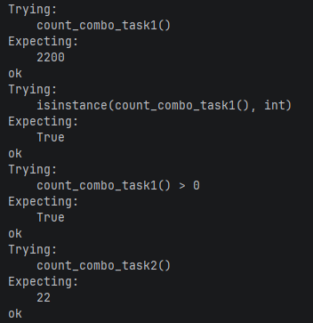
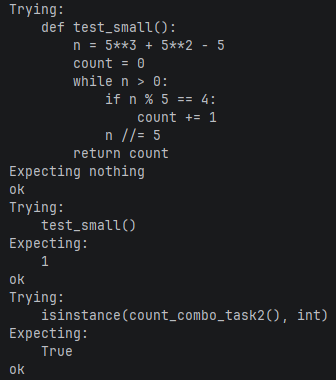
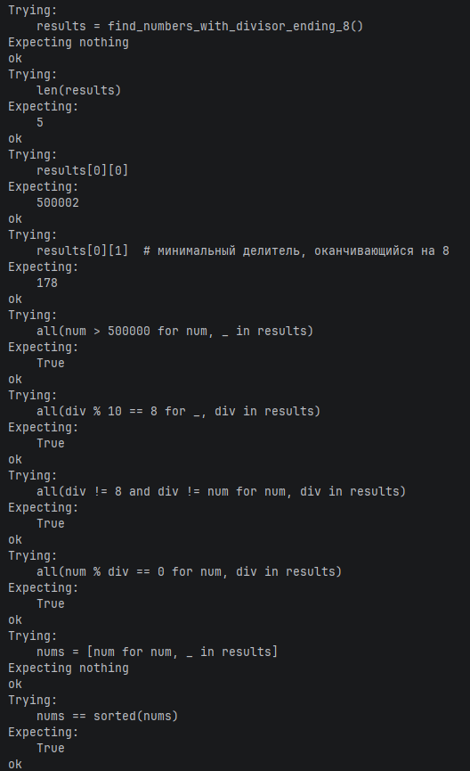
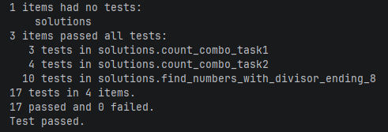

# Лабораторная работа №3
## Расчётные задачи.
## 1. Условие:
Напишите для функций доктесты
## 2. Описание проделанной работы:

## 3. Программа
```python
from itertools import product


# ============================================================================
# ЗАДАЧА 1: Подсчёт 5-буквенных слов из букв ГЕПАРД
# ============================================================================

def count_combo_task1():
    """
    Подсчитывает количество 5-буквенных слов из букв 'Г', 'Е', 'П', 'А', 'Р', 'Д',
    удовлетворяющих условиям:
    - ровно одна буква 'Г'
    - слово не начинается на букву 'А'
    - слово не заканчивается на букву 'Е'

    Returns:
        int: количество подходящих слов

    Примеры:
    >>> count_combo_task1()
    2200

    >>> isinstance(count_combo_task1(), int)
    True

    >>> count_combo_task1() > 0
    True
    """
    letters = ('Г', 'Е', 'П', 'А', 'Р', 'Д')
    count = 0
    for combo in product(letters, repeat=5):
        word = list(combo)
        if word.count('Г') == 1 and word[0] != 'А' and word[-1] != 'Е':
            count += 1
    return count


# ============================================================================
# ЗАДАЧА 2: Подсчёт цифр 4 в пятеричной записи числа 5^36 + 5^24 - 25
# ============================================================================

def count_combo_task2():
    """
    Вычисляет количество цифр 4 в пятеричной записи числа 5^36 + 5^24 - 25.

    Returns:
        int: количество четвёрок в пятеричном представлении

    Примеры:
    >>> count_combo_task2()
    22

    >>> # Проверка на маленьком аналоге: 5^3 + 5^2 - 5 = 145
    >>> def test_small():
    ...     n = 5**3 + 5**2 - 5
    ...     count = 0
    ...     while n > 0:
    ...         if n % 5 == 4:
    ...             count += 1
    ...         n //= 5
    ...     return count
    >>> test_small()
    1

    >>> isinstance(count_combo_task2(), int)
    True
    """
    s = 5 ** 36 + 5 ** 24 - 25
    count = 0
    n = s
    while n > 0:
        if n % 5 == 4:
            count += 1
        n //= 5
    return count


# ============================================================================
# ЗАДАЧА 3: Поиск чисел с делителем, оканчивающимся на 8
# ============================================================================

def find_numbers_with_divisor_ending_8():
    """
    Находит 5 наименьших чисел больше 500000, у которых есть делитель,
    оканчивающийся на 8, при этом этот делитель не равен 8 и не равен самому числу.

    Returns:
        list of tuple: список из 5 кортежей (число, минимальный_подходящий_делитель)

    Примеры:
    >>> results = find_numbers_with_divisor_ending_8()
    >>> len(results)
    5

    >>> # Проверка первого числа
    >>> results[0][0]
    500002

    >>> results[0][1]  # минимальный делитель, оканчивающийся на 8
    178

    >>> # Все числа больше 500000
    >>> all(num > 500000 for num, _ in results)
    True

    >>> # Все делители оканчиваются на 8
    >>> all(div % 10 == 8 for _, div in results)
    True

    >>> # Делитель не равен 8 и не равен самому числу
    >>> all(div != 8 and div != num for num, div in results)
    True

    >>> # Делитель действительно делит число
    >>> all(num % div == 0 for num, div in results)
    True

    >>> # Числа упорядочены по возрастанию
    >>> nums = [num for num, _ in results]
    >>> nums == sorted(nums)
    True
    """
    results = []
    num = 500001

    while len(results) < 5:
        divisors_ending_8 = []

        for i in range(1, int(num ** 0.5) + 1):
            if num % i == 0:
                if i % 10 == 8 and i != 8 and i != num:
                    divisors_ending_8.append(i)
                j = num // i
                if j != i and j % 10 == 8 and j != 8 and j != num:
                    divisors_ending_8.append(j)

        if divisors_ending_8:
            min_divisor = min(divisors_ending_8)
            results.append((num, min_divisor))

        num += 1

    return results


# ============================================================================
# ЗАПУСК ВСЕХ ТЕСТОВ
# ============================================================================

if __name__ == "__main__":
    import doctest

    print("=" * 60)
    print("РЕЗУЛЬТАТЫ ВЫЧИСЛЕНИЙ")
    print("=" * 60)

    print(f"\nЗадача 1: {count_combo_task1()} слов")
    print(f"Задача 2: {count_combo_task2()} цифр 4")
    print("\nЗадача 3 (первые 5 чисел больше 500000):")
    numbers = find_numbers_with_divisor_ending_8()
    for number, divisor in numbers:
        print(f"  {number} {divisor}")

    print("\n" + "=" * 60)
    print("ЗАПУСК ДОКТЕСТОВ")
    print("=" * 60)

    # Запускаем doctest
    doctest.testmod(verbose=True)
```
## 4. Вывод




---