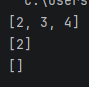
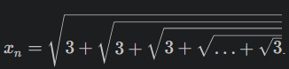
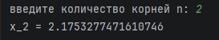

# Рекурсия
## Задание 1
## 1. Условие:
Функция для нахождения пересечения двух списков.
```python
>>> intersect([1, 2, 3, 4], [2, 3, 4, 6, 8])
[2, 4]
>>> intersect([5, 8, 2], [2, 9, 1])
[2]
>>> intersect([5, 8, 2], [7, 4])
[]
```
## 2. Описание проделанной работы:
Создаем функцию, потом находим пересечение двух списков.
## 3. Программа
```python
def intersect(list1, list2):
    return list(set(list1) & set(list2))

print(intersect([1, 2, 3, 4], [2, 3, 4, 6, 8]))
print(intersect([5, 8, 2], [2, 9, 1]))
print(intersect([5, 8, 2], [7, 4]))
```
## 4. Вывод


---

## Задание 2
## 1. Условие:
Функция для расчёта  (n корней)
## 2. Описание проделанной работы:
Сначала импортировали библиотеку, потом создали функцию для нашего выражения. Далее запросили ввод n и вычислили результат. и в конце конструкция для запуска функции main(). 
## 3. Программа
```python
import math

def root(n):
    if n == 1:
        return math.sqrt(3)
    else:
        return math.sqrt(3 + root(n-1))
def main():
    try:
        n = int(input('введите количество корней n: '))
        if n < 2:
            print('n должно быть >= 1')
            return
        result = root(n)
        print(f'x_{n} = {result}')
    except ValueError:
        print('Ошибка: введите целое число')

if __name__ == "__main__":
    main()
```
## 4. Вывод

