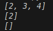
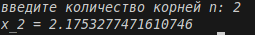

# Рекурсия
## Задание 1
## С рекурсией
## 1. Условие:
Напишите две функции для решения задач своего варианта - с использованием рекурсии и без.
Функция для нахождения пересечения двух списков.
```python
>>> intersect([1, 2, 3, 4], [2, 3, 4, 6, 8])
[2, 4]
>>> intersect([5, 8, 2], [2, 9, 1])
[2]
>>> intersect([5, 8, 2], [7, 4])
[]
```
## 2. Описание проделанной работы:
Создаем заголовок функции и ее параметры, далее создаем пустой список для сбора общих элементов, потом возвращаем накопленный результат и делаем проверку есть ли во втором списке и еще не добавлен, то добавляем в результат. И в конце добавляем рекурсивный вызов.
## 3. Программа
```python
def intersect_recursive(list1, list2, result=None, index=0):
    if result is None:
        result = []
    
    if index >= len(list1):
        return result
    
    current_element = list1[index]
    
    if current_element in list2 and current_element not in result:
        result.append(current_element)
    
    return intersect_recursive(list1, list2, result, index + 1)

print(intersect_recursive([1, 2, 3, 4], [2, 3, 4, 6, 8]))
print(intersect_recursive([5, 8, 2], [2, 9, 1]))
print(intersect_recursive([5, 8, 2], [7, 4]))
```
## 4. Вывод


---
## Задание 1
## Без рекурсии
## 1. Условие:
Напишите две функции для решения задач своего варианта - с использованием рекурсии и без.
Функция для нахождения пересечения двух списков.
```python
>>> intersect([1, 2, 3, 4], [2, 3, 4, 6, 8])
[2, 4]
>>> intersect([5, 8, 2], [2, 9, 1])
[2]
>>> intersect([5, 8, 2], [7, 4])
[]
```
## 2. Описание проделанной работы:
Создаем функцию, потом находим пересечение двух списков.
## 3. Программа
```python
def intersect(list1, list2):
    return list(set(list1) & set(list2))

print(intersect([1, 2, 3, 4], [2, 3, 4, 6, 8]))
print(intersect([5, 8, 2], [2, 9, 1]))
print(intersect([5, 8, 2], [7, 4]))
```
## 4. Вывод


---

## Задание 2
## С рекурсией
## 1. Условие:
Функция для расчёта  (n корней)
## 2. Описание проделанной работы:
Сначала импортировали библиотеку, потом создали функцию для нашего выражения. Далее запросили ввод n и вычислили результат. и в конце конструкция для запуска функции main(). 
## 3. Программа
```python
import math

def root(n):
    if n == 1:
        return math.sqrt(3)
    else:
        return math.sqrt(3 + root(n-1))
def main():
    try:
        n = int(input('введите количество корней n: '))
        if n < 2:
            print('n должно быть >= 1')
            return
        result = root(n)
        print(f'x_{n} = {result}')
    except ValueError:
        print('Ошибка: введите целое число')

if __name__ == "__main__":
    main()
```
## 4. Вывод


---

## Задание 2
## Без рекурсией
## 1. Условие:
Функция для расчёта  (n корней)
## 2. Описание проделанной работы:
Сначала импортируем библиотеку, проверяем, чтобы n было больше 0, назначам для n_1 значение корня из 3 и далее добавляем внешние корни через цикл for. После возвращаем результат и создаем функцию mail, которая будет запрашивать число и проверять его, выводить результат. В конце запуск функции main().
## 3. Программа
```python
import math

def root_iterative(n):
    if n < 1:
        return None
    
    result = math.sqrt(3)  # для n = 1
    
    for i in range(2, n + 1):
        result = math.sqrt(3 + result)
    
    return result

def main():
    try:
        n = int(input('введите количество корней n: '))
        if n < 1:
            print('n должно быть >= 1')
            return
        
        result = root_iterative(n)
        print(f'x_{n} = {result}')
        
    except ValueError:
        print('Ошибка: введите целое число')

if __name__ == "__main__":
    main()
```
## 4. Вывод
