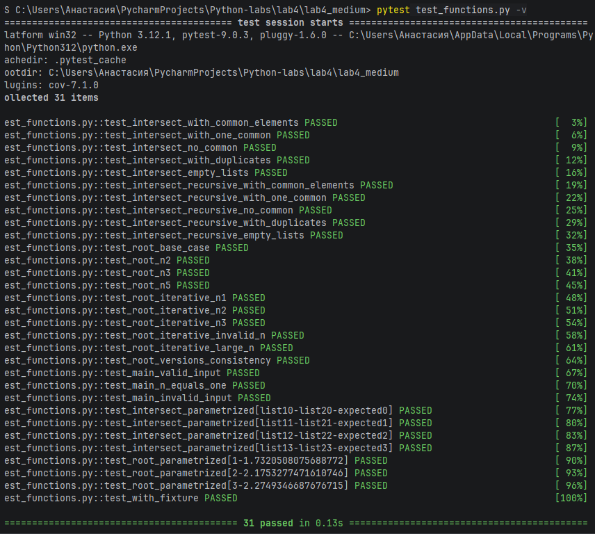

# Отчет по лабораторной работе №4
## Рекурсия
## 1. Условие:
Напишите для своих функций тесты с помощью pytest
## 2. Описание проделанной работы:
### Разработанные тесты:

1. **Тесты для `intersect`** (5 тестов):
- Проверка с общими элементами
- Проверка с одним общим элементом
- Проверка без общих элементов
- Проверка с дубликатами
- Проверка с пустыми списками

2. **Тесты для `intersect_recursive`** (5 тестов):
- Аналогичные проверки для рекурсивной версии

3. **Тесты для `root`** (4 теста):
- Базовый случай n=1
- Значения для n=2, n=3
- Проверка корректности для n=5

4. **Тесты для `root_iterative`** (5 тестов):
- Значения для n=1,2,3
- Проверка недопустимых значений (n<1)
- Проверка для больших значений n=10

5. **Сравнительный тест**:
- Согласованность рекурсивной и итеративной версий для n от 1 до 5

6. **Тесты для `main()`** (3 теста):
- Корректный ввод (n=3)
- Ввод n=1 (ошибка)
- Некорректный ввод ("abc")

7. **Параметризованные тесты**:
- Для `intersect` с 4 наборами данных
- Для `root` с 3 значениями n

8. **Использование фикстуры**:
- Создание тестовых данных через `@pytest.fixture`
## 3. Программа
```python
import pytest
import math
from unittest.mock import patch
from io import StringIO


# ============ ВАШИ ФУНКЦИИ ============
def intersect(list1, list2):
    return list(set(list1) & set(list2))


def intersect_recursive(list1, list2, result=None, index=0):
    if result is None:
        result = []

    if index >= len(list1):
        return result

    current_element = list1[index]

    # Проверяем, есть ли элемент в обоих списках и ещё не добавлен в результат
    if current_element in list2 and current_element not in result:
        result.append(current_element)

    return intersect_recursive(list1, list2, result, index + 1)


def root(n):
    if n == 1:
        return math.sqrt(3)
    else:
        return math.sqrt(3 + root(n - 1))


def root_iterative(n):
    if n < 1:
        return None

    result = math.sqrt(3)  # для n = 1

    for i in range(2, n + 1):
        result = math.sqrt(3 + result)

    return result


def main():
    try:
        n = int(input('введите количество корней n: '))
        if n < 2:
            print('n должно быть >= 1')
            return
        result = root(n)
        print(f'x_{n} = {result}')
    except ValueError:
        print('Ошибка: введите целое число')


# ============ ТЕСТЫ ============

# Тесты для intersect (обычная версия)
def test_intersect_with_common_elements():
    """Тест с общими элементами"""
    result = intersect([1, 2, 3, 4], [2, 3, 4, 6, 8])
    assert set(result) == {2, 3, 4}
    assert len(result) == 3


def test_intersect_with_one_common():
    """Тест с одним общим элементом"""
    result = intersect([5, 8, 2], [2, 9, 1])
    assert result == [2]


def test_intersect_no_common():
    """Тест без общих элементов"""
    result = intersect([5, 8, 2], [7, 4])
    assert result == []


def test_intersect_with_duplicates():
    """Тест с дубликатами в списках"""
    result = intersect([1, 1, 2, 2, 3], [2, 2, 3, 4])
    assert set(result) == {2, 3}


def test_intersect_empty_lists():
    """Тест с пустыми списками"""
    result = intersect([], [1, 2, 3])
    assert result == []
    result = intersect([1, 2, 3], [])
    assert result == []
    result = intersect([], [])
    assert result == []


# Тесты для intersect_recursive
def test_intersect_recursive_with_common_elements():
    """Тест рекурсивной версии с общими элементами"""
    result = intersect_recursive([1, 2, 3, 4], [2, 3, 4, 6, 8])
    assert result == [2, 3, 4]


def test_intersect_recursive_with_one_common():
    """Тест рекурсивной версии с одним общим элементом"""
    result = intersect_recursive([5, 8, 2], [2, 9, 1])
    assert result == [2]


def test_intersect_recursive_no_common():
    """Тест рекурсивной версии без общих элементов"""
    result = intersect_recursive([5, 8, 2], [7, 4])
    assert result == []


def test_intersect_recursive_with_duplicates():
    """Тест рекурсивной версии с дубликатами"""
    result = intersect_recursive([1, 1, 2, 2, 3], [2, 2, 3, 4])
    assert result == [2, 3]


def test_intersect_recursive_empty_lists():
    """Тест рекурсивной версии с пустыми списками"""
    result = intersect_recursive([], [1, 2, 3])
    assert result == []
    result = intersect_recursive([1, 2, 3], [])
    assert result == []


# Тесты для root (рекурсивная версия)
def test_root_base_case():
    """Тест базового случая n=1"""
    result = root(1)
    assert result == math.sqrt(3)


def test_root_n2():
    """Тест для n=2"""
    result = root(2)
    expected = math.sqrt(3 + math.sqrt(3))
    assert abs(result - expected) < 1e-9


def test_root_n3():
    """Тест для n=3"""
    result = root(3)
    expected = math.sqrt(3 + math.sqrt(3 + math.sqrt(3)))
    assert abs(result - expected) < 1e-9


def test_root_n5():
    """Тест для n=5"""
    result = root(5)
    assert isinstance(result, float)
    assert result > 0


# Тесты для root_iterative (итеративная версия)
def test_root_iterative_n1():
    """Тест итеративной версии для n=1"""
    result = root_iterative(1)
    assert result == math.sqrt(3)


def test_root_iterative_n2():
    """Тест итеративной версии для n=2"""
    result = root_iterative(2)
    expected = math.sqrt(3 + math.sqrt(3))
    assert abs(result - expected) < 1e-9


def test_root_iterative_n3():
    """Тест итеративной версии для n=3"""
    result = root_iterative(3)
    expected = math.sqrt(3 + math.sqrt(3 + math.sqrt(3)))
    assert abs(result - expected) < 1e-9


def test_root_iterative_invalid_n():
    """Тест для недопустимого n (< 1)"""
    assert root_iterative(0) is None
    assert root_iterative(-5) is None


def test_root_iterative_large_n():
    """Тест для большого n"""
    result = root_iterative(10)
    assert isinstance(result, float)
    assert result > 0


# Сравнение рекурсивной и итеративной версий
def test_root_versions_consistency():
    """Тест согласованности рекурсивной и итеративной версий"""
    for n in range(1, 6):
        recursive_result = root(n)
        iterative_result = root_iterative(n)
        assert abs(recursive_result - iterative_result) < 1e-9


# Тесты для main функций с имитацией ввода
@patch('builtins.input', side_effect=['3'])
@patch('sys.stdout', new_callable=StringIO)
def test_main_valid_input(mock_stdout, mock_input):
    """Тест main функции с корректным вводом"""
    main()
    output = mock_stdout.getvalue()
    assert 'x_3 =' in output


@patch('builtins.input', side_effect=['1'])
@patch('sys.stdout', new_callable=StringIO)
def test_main_n_equals_one(mock_stdout, mock_input):
    """Тест main функции с n=1 (должна выдать ошибку)"""
    main()
    output = mock_stdout.getvalue()
    assert 'n должно быть >= 1' in output


@patch('builtins.input', side_effect=['abc'])
@patch('sys.stdout', new_callable=StringIO)
def test_main_invalid_input(mock_stdout, mock_input):
    """Тест main функции с некорректным вводом"""
    main()
    output = mock_stdout.getvalue()
    assert 'Ошибка: введите целое число' in output


# Параметризованные тесты
@pytest.mark.parametrize("list1, list2, expected", [
    ([1, 2, 3, 4], [2, 3, 4, 6, 8], [2, 3, 4]),
    ([5, 8, 2], [2, 9, 1], [2]),
    ([5, 8, 2], [7, 4], []),
    ([1, 1, 2], [1, 2, 3], [1, 2]),
])
def test_intersect_parametrized(list1, list2, expected):
    """Параметризованный тест для intersect"""
    result = intersect(list1, list2)
    assert set(result) == set(expected)


@pytest.mark.parametrize("n, expected_approx", [
    (1, math.sqrt(3)),
    (2, math.sqrt(3 + math.sqrt(3))),
    (3, math.sqrt(3 + math.sqrt(3 + math.sqrt(3)))),
])
def test_root_parametrized(n, expected_approx):
    """Параметризованный тест для root"""
    result = root(n)
    assert abs(result - expected_approx) < 1e-9


# Фикстура для создания тестовых данных
@pytest.fixture
def sample_lists():
    """Фикстура с примерами списков для тестирования"""
    return {
        'list1': [1, 2, 3, 4, 5],
        'list2': [3, 4, 5, 6, 7],
        'expected_intersection': [3, 4, 5]
    }


def test_with_fixture(sample_lists):
    """Использование фикстуры в тесте"""
    result = intersect(sample_lists['list1'], sample_lists['list2'])
    assert set(result) == set(sample_lists['expected_intersection'])


# Точка входа для запуска тестов
if __name__ == "__main__":
    pytest.main([__file__, "-v", "--cov=.", "--cov-report=html"])
```
## 4. Вывод

---