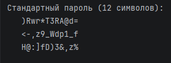

# Генератор паролей

## Условия задачи

Разработать генератор паролей на языке Python, который:

1. Генерирует пароли длиной 12 символов
2. Использует все типы символов:
   - Строчные буквы (a-z)
   - Заглавные буквы (A-Z)
   - Цифры (0-9)
   - Специальные символы (!@#$%^&*()_+-=[]{}|;:,.<>?)
3. Выводит 3 сгенерированных пароля
4. Гарантирует наличие хотя бы одного символа каждого типа в пароле

## Описание проделанной работы

### Структура программы

Программа состоит из двух основных частей:
1. **Класс `PasswordGenerator`** — содержит всю логику генерации паролей
2. **Функция `main()`** — демонстрирует работу генератора

### Класс PasswordGenerator

#### Конструктор `__init__()`
Инициализирует наборы символов для генерации паролей:

```python
self.lowercase = string.ascii_lowercase  # a-z
self.uppercase = string.ascii_uppercase  # A-Z
self.digits = string.digits              # 0-9
self.special = "!@#$%^&*()_+-=[]{}|;:,.<>?"
```
Метод generate_password()
Основной метод, который создаёт пароль со следующими параметрами по умолчанию:

- length = 12 — длина пароля

- use_upper = True — использовать заглавные буквы

- use_lower = True — использовать строчные буквы

- use_digits = True — использовать цифры

- use_special = True — использовать спецсимволы

- exclude_ambiguous = False — не исключать неоднозначные символы

Алгоритм работы:

1. Формируется пул символов на основе выбранных типов

2. Генерируется случайный пароль заданной длины

3. Проверяется наличие хотя бы одного символа каждого типа

4. Если проверка не пройдена — генерация повторяется

Функция main()
Выводит заголовок и 3 сгенерированных пароля:

```python
def main():
    pg = PasswordGenerator()
    print("Стандартный пароль (12 символов):")
    for i in range(3):
        print(f"   {pg.generate_password()}")
```
## Программа:
```python
import random
import string


class PasswordGenerator:
    def __init__(self):
        # Наборы символов
        self.lowercase = string.ascii_lowercase  # a-z
        self.uppercase = string.ascii_uppercase  # A-Z
        self.digits = string.digits  # 0-9
        self.special = "!@#$%^&*()_+-=[]{}|;:,.<>?"

    def generate_password(self, length=12, use_upper=True, use_lower=True,
                          use_digits=True, use_special=True, exclude_ambiguous=False):
        """
        Генерация пароля по заданным правилам

        Параметры:
        - length: длина пароля
        - use_upper: использовать заглавные буквы
        - use_lower: использовать строчные буквы
        - use_digits: использовать цифры
        - use_special: использовать спецсимволы
        - exclude_ambiguous: исключить неоднозначные символы (l,1,I,O,0)
        """

        # Формируем пул символов
        char_pool = ""

        if use_lower:
            char_pool += self.lowercase
        if use_upper:
            char_pool += self.uppercase
        if use_digits:
            char_pool += self.digits
        if use_special:
            char_pool += self.special

        if not char_pool:
            raise ValueError("Должен быть выбран хотя бы один тип символов")

        # Исключаем неоднозначные символы если нужно
        if exclude_ambiguous:
            ambiguous = 'l1I0O'
            char_pool = ''.join(c for c in char_pool if c not in ambiguous)

        # Генерируем пароль
        password = ''.join(random.choice(char_pool) for _ in range(length))

        # Проверяем, что пароль содержит хотя бы один символ из каждого выбранного типа
        checks = []
        if use_lower:
            checks.append(any(c.islower() for c in password))
        if use_upper:
            checks.append(any(c.isupper() for c in password))
        if use_digits:
            checks.append(any(c.isdigit() for c in password))
        if use_special:
            checks.append(any(c in self.special for c in password))

        # Если проверка не пройдена, генерируем заново
        if not all(checks):
            return self.generate_password(length, use_upper, use_lower,
                                          use_digits, use_special, exclude_ambiguous)

        return password

    def generate_multiple(self, count=5, **kwargs):
        """Генерирует несколько паролей"""
        passwords = []
        for _ in range(count):
            passwords.append(self.generate_password(**kwargs))
        return passwords


def main():
    pg = PasswordGenerator()

    print("Стандартный пароль (12 символов):")
    for i in range(3):
        print(f"   {pg.generate_password()}")


if __name__ == "__main__":
    main()
```
## Вывод:
