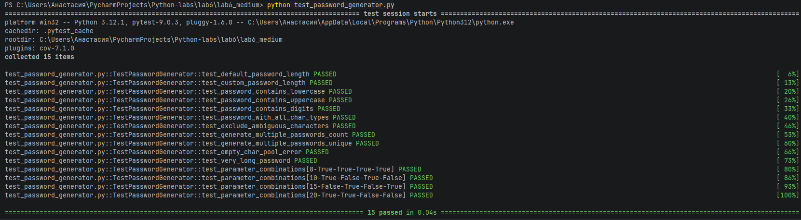

# Отчет по лабораторной работе №6
## Генераторы
## Условие
Напишите для генератора паролей (PasswordGenerator) тесты с помощью pytest.
## Описание проделанной работы
В ходе работы был разработан класс PasswordGenerator для генерации случайных паролей с настраиваемыми параметрами и написаны автоматические тесты с использованием фреймворка pytest.

Функциональность генератора:

- Генерация паролей заданной длины (по умолчанию 12 символов)
- Поддержка различных типов символов: строчные буквы, заглавные буквы, цифры, специальные символы
- Возможность исключения неоднозначных символов (l, 1, I, O, 0)
- Генерация нескольких паролей одновременно
- Проверка, что пароль содержит хотя бы один символ из каждого выбранного типа

Разработанные тесты (15 тестов):

1. Проверка длины пароля по умолчанию

2. Проверка длины пароля с произвольными значениями

3. Проверка наличия строчных букв

4. Проверка наличия заглавных букв

5. Проверка наличия цифр

6. Проверка наличия всех типов символов

7. Проверка исключения неоднозначных символов

8. Проверка количества генерируемых паролей

9. Проверка уникальности сгенерированных паролей

10. Проверка обработки ошибки при пустом пуле символов

11. Проверка генерации очень длинного пароля (500 символов)

12-15. Параметризованные тесты различных комбинаций параметров

## 3. Программа
```python
import pytest
import random
import string


class PasswordGenerator:
    def __init__(self):
        self.lowercase = string.ascii_lowercase
        self.uppercase = string.ascii_uppercase
        self.digits = string.digits
        self.special = "!@#$%^&*()_+-=[]{}|;:,.<>?"

    def generate_password(self, length=12, use_upper=True, use_lower=True,
                          use_digits=True, use_special=True, exclude_ambiguous=False):
        char_pool = ""

        if use_lower:
            char_pool += self.lowercase
        if use_upper:
            char_pool += self.uppercase
        if use_digits:
            char_pool += self.digits
        if use_special:
            char_pool += self.special

        if not char_pool:
            raise ValueError("Должен быть выбран хотя бы один тип символов")

        if exclude_ambiguous:
            ambiguous = 'l1I0O'
            char_pool = ''.join(c for c in char_pool if c not in ambiguous)

        password = ''.join(random.choice(char_pool) for _ in range(length))

        checks = []
        if use_lower:
            checks.append(any(c.islower() for c in password))
        if use_upper:
            checks.append(any(c.isupper() for c in password))
        if use_digits:
            checks.append(any(c.isdigit() for c in password))
        if use_special:
            checks.append(any(c in self.special for c in password))

        if not all(checks):
            return self.generate_password(length, use_upper, use_lower,
                                          use_digits, use_special, exclude_ambiguous)

        return password

    def generate_multiple(self, count=5, **kwargs):
        passwords = []
        for _ in range(count):
            passwords.append(self.generate_password(**kwargs))
        return passwords


# ============= ТЕСТЫ =============

class TestPasswordGenerator:

    def setup_method(self):
        self.pg = PasswordGenerator()
        random.seed(42)

    def test_default_password_length(self):
        password = self.pg.generate_password()
        assert len(password) == 12

    def test_custom_password_length(self):
        lengths = [8, 16, 20, 32]
        for length in lengths:
            password = self.pg.generate_password(length=length)
            assert len(password) == length

    def test_password_contains_lowercase(self):
        password = self.pg.generate_password(use_upper=False, use_digits=False, use_special=False)
        assert any(c.islower() for c in password)

    def test_password_contains_uppercase(self):
        password = self.pg.generate_password(use_lower=False, use_digits=False, use_special=False)
        assert any(c.isupper() for c in password)

    def test_password_contains_digits(self):
        password = self.pg.generate_password(use_lower=False, use_upper=False, use_special=False)
        assert any(c.isdigit() for c in password)

    def test_password_with_all_char_types(self):
        for _ in range(10):
            password = self.pg.generate_password(length=20)
            assert any(c.islower() for c in password)
            assert any(c.isupper() for c in password)
            assert any(c.isdigit() for c in password)
            assert any(c in "!@#$%^&*()_+-=[]{}|;:,.<>?" for c in password)

    def test_exclude_ambiguous_characters(self):
        ambiguous = set('l1I0O')
        for _ in range(20):
            password = self.pg.generate_password(length=20, exclude_ambiguous=True)
            password_chars = set(password)
            assert password_chars.isdisjoint(ambiguous)

    def test_generate_multiple_passwords_count(self):
        counts = [1, 3, 5]
        for count in counts:
            passwords = self.pg.generate_multiple(count=count)
            assert len(passwords) == count

    def test_generate_multiple_passwords_unique(self):
        passwords = self.pg.generate_multiple(count=10)
        assert len(passwords) == len(set(passwords))

    def test_empty_char_pool_error(self):
        with pytest.raises(ValueError, match="Должен быть выбран хотя бы один тип символов"):
            self.pg.generate_password(use_lower=False, use_upper=False,
                                      use_digits=False, use_special=False)

    def test_very_long_password(self):
        password = self.pg.generate_password(length=500)
        assert len(password) == 500

    @pytest.mark.parametrize("length,use_upper,use_lower,use_digits,use_special", [
        (8, True, True, True, True),
        (10, True, False, True, False),
        (15, False, True, False, True),
        (20, True, True, False, False),
    ])
    def test_parameter_combinations(self, length, use_upper, use_lower, use_digits, use_special):
        password = self.pg.generate_password(
            length=length,
            use_upper=use_upper,
            use_lower=use_lower,
            use_digits=use_digits,
            use_special=use_special
        )
        assert len(password) == length

        if use_upper:
            assert any(c.isupper() for c in password)
        if use_lower:
            assert any(c.islower() for c in password)
        if use_digits:
            assert any(c.isdigit() for c in password)


if __name__ == "__main__":
    pytest.main([__file__, "-v"])
```
## 4. Вывод

