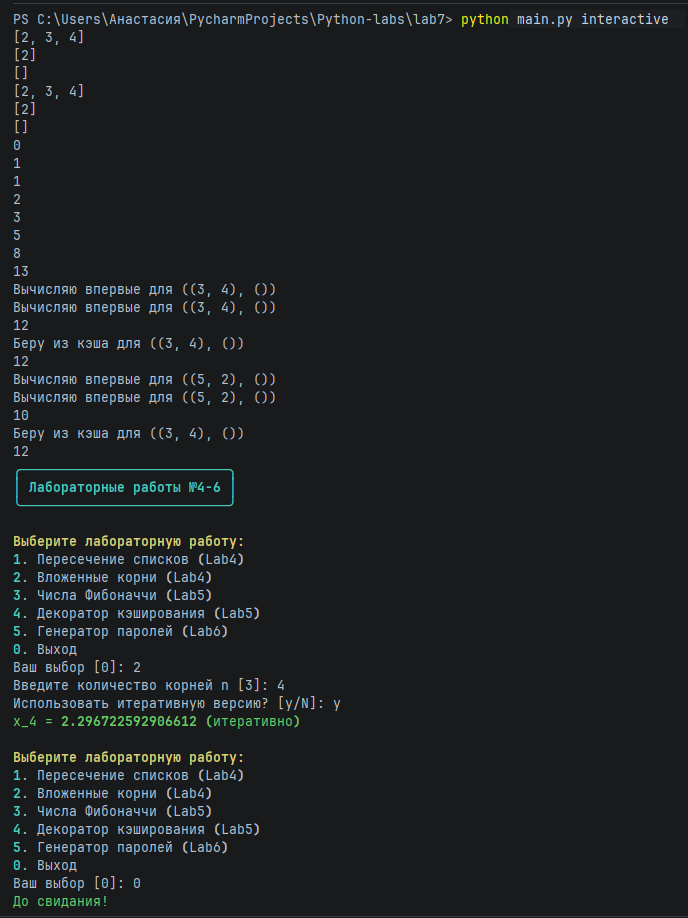

# Отчёт по лабораторной работе №7
## Пакеты и модули

### 1. Условия задач

Создать пакет `package`, содержащий 3 модуля на основе лабораторных работ №4-6:
- **Lab4**: Функции для нахождения пересечения списков (итеративная и рекурсивная версии) и вычисления вложенных корней (итеративная и рекурсивная версии)
- **Lab5**: Генератор чисел Фибоначчи с использованием замыкания и декоратор кэширования результатов
- **Lab6**: Генератор паролей с настраиваемыми параметрами

Написать запускающий модуль `main.py` на основе библиотеки **Typer**, который позволяет:
- Выбирать нужную лабораторную работу через систему команд
- Настраивать параметры запуска через аргументы командной строки
- Работать в интерактивном режиме с меню

### 2. Описание проделанной работы

#### 2.1. Структура созданного пакета

Разработана следующая структура пакета:
lab7/

├── package/ # Основной пакет

│ ├── init.py # Инициализация пакета, экспорт функций

│ ├── lab4/ # Модуль Lab4

│ │ ├── nomber1.py # Пересечение списков (итеративная версия)

│ │ ├── number2.py # Вложенные корни (рекурсивная версия)

│ │ ├── number11.py # Пересечение списков (рекурсивная версия)

│ │ └── number21.py # Вложенные корни (итеративная версия)

│ ├── lab5/ # Модуль Lab5

│ │ ├── fibonacci.py # Генератор чисел Фибоначчи (замыкание)

│ │ └── decorator.py # Декоратор кэширования

│ └── lab6/ # Модуль Lab6

│ └── gen.py # Класс PasswordGenerator

├── main.py # Запускающий модуль с Typer

└── README.md # Отчёт


#### 2.2. Реализация модулей пакета

**Lab4 (работа со списками и вычислениями):**
- `intersect(list1, list2)` - находит пересечение двух списков итеративным способом
- `intersect_recursive(list1, list2)` - рекурсивная версия пересечения списков
- `root(n)` - рекурсивное вычисление вложенных корней: √(3 + √(3 + √(3 + ...)))
- `root_iterative(n)` - итеративная версия вычисления вложенных корней

**Lab5 (функциональное программирование):**
- `fibonacci_closure()` - замыкание, генерирующее последовательность Фибоначчи. При каждом вызове возвращает следующее число последовательности
- `cache_decorator(func)` - декоратор, кэширующий результаты вызовов функции. При повторном вызове с теми же аргументами возвращает сохранённое значение

**Lab6 (генератор паролей):**
- Класс `PasswordGenerator` с методами:
  - `generate(length, ...)` - генерация одного пароля
  - `generate_multiple(count, length, ...)` - генерация нескольких паролей
- Поддерживаемые параметры:
  - Заглавные/строчные буквы
  - Цифры
  - Специальные символы
  - Исключение неоднозначных символов (il1Lo0O)

#### 2.3. Разработка CLI интерфейса на Typer

Создан модуль `main.py`, который использует библиотеки:
- **Typer** - для создания командной строки
- **Rich** - для красивого форматирования вывода (цвета, таблицы, панели)

**Доступные команды:**

| Команда | Описание | Пример использования |
|---------|----------|---------------------|
| `intersect-cmd` | Пересечение списков | `python main.py intersect-cmd --list1 "1,2,3" --list2 "2,3,4"` |
| `root-cmd` | Вложенные корни | `python main.py root-cmd --n 5 --iterative` |
| `fibonacci-cmd` | Числа Фибоначчи | `python main.py fibonacci-cmd --count 10` |
| `cache-demo-cmd` | Демонстрация кэширования | `python main.py cache-demo-cmd --x 5 --y 6` |
| `password-cmd` | Генерация паролей | `python main.py password-cmd --length 16 --count 3` |
| `interactive` | Интерактивный режим | `python main.py interactive` |

**Особенности реализации:**
- Поддержка как коротких (`-l1`), так и длинных (`--list1`) ключей
- Проверка корректности введённых данных
- Цветовой вывод для улучшения читаемости
- Встроенная справка по командам (`--help`)
- Интерактивный режим с пошаговым меню

#### 2.4. Сборка и тестирование

Для работы программы необходимо установить зависимости:
```bash
pip install typer rich
```

#### 2.5. Запуск программы

- Показать справку

python main.py

- Запуск в интерактивном режиме

python main.py interactive

- Выполнение конкретной команды

python main.py intersect-cmd -l1 "1,2,3,4" -l2 "2,4,6,8" -r

### Программа:

```python
"""
CLI интерфейс для лабораторных работ №4-6
Использует Typer для создания командной строки
"""

import typer
from typing import Optional, List
from rich import print as rprint
from rich.table import Table
from rich.console import Console
from rich.panel import Panel

# Импорты из вашего пакета
from package import (
    intersect,
    root,
    intersect_recursive,
    root_iterative,
    fibonacci_closure,
    cache_decorator,
    PasswordGenerator
)

app = typer.Typer(help="CLI для запуска лабораторных работ №4-6", add_completion=False)
console = Console()

# Создаем экземпляр генератора паролей
pg = PasswordGenerator()


@app.command()
def intersect_cmd(
        list1: str = typer.Option(..., "--list1", "-l1", help="Первый список (через запятую)"),
        list2: str = typer.Option(..., "--list2", "-l2", help="Второй список (через запятую)"),
        recursive: bool = typer.Option(False, "--recursive", "-r", help="Использовать рекурсивную версию")
):
    """
    Находит пересечение двух списков
    """
    # Преобразуем строки в списки
    l1 = [int(x.strip()) for x in list1.split(',')]
    l2 = [int(x.strip()) for x in list2.split(',')]

    console.print(f"[cyan]Первый список:[/cyan] {l1}")
    console.print(f"[cyan]Второй список:[/cyan] {l2}")

    if recursive:
        result = intersect_recursive(l1, l2)
        console.print(f"[green]Результат (рекурсивно):[/green] {result}")
    else:
        result = intersect(l1, l2)
        console.print(f"[green]Результат:[/green] {result}")


@app.command()
def root_cmd(
        n: int = typer.Option(..., "--n", "-n", help="Количество корней"),
        iterative: bool = typer.Option(False, "--iterative", "-i", help="Использовать итеративную версию")
):
    """
    Вычисляет вложенные корни: sqrt(3 + sqrt(3 + sqrt(3 + ...)))
    """
    if n < 1:
        console.print("[red]Ошибка: n должно быть >= 1[/red]")
        raise typer.Exit(1)

    if iterative:
        result = root_iterative(n)
        console.print(f"[green]x_{n} = {result} (итеративно)[/green]")
    else:
        result = root(n)
        console.print(f"[green]x_{n} = {result} (рекурсивно)[/green]")


@app.command()
def fibonacci_cmd(
        count: int = typer.Option(10, "--count", "-c", help="Количество чисел Фибоначчи")
):
    """
    Генерирует числа Фибоначчи с помощью замыкания
    """
    if count < 1:
        console.print("[red]Ошибка: count должно быть >= 1[/red]")
        raise typer.Exit(1)

    fib = fibonacci_closure()
    numbers = [fib() for _ in range(count)]

    table = Table(title=f"Первые {count} чисел Фибоначчи")
    table.add_column("Индекс", style="cyan")
    table.add_column("Значение", style="green")

    for i, num in enumerate(numbers):
        table.add_row(str(i), str(num))

    console.print(table)


@app.command()
def cache_demo_cmd(
        x: int = typer.Option(3, "--x", help="Первый множитель"),
        y: int = typer.Option(4, "--y", help="Второй множитель")
):
    """
    Демонстрирует работу декоратора кэширования
    """

    @cache_decorator
    def slow_multiply(a: int, b: int) -> int:
        import time
        time.sleep(2)
        return a * b

    console.print(f"[yellow]Вычисление {x} * {y} (первый раз - будет задержка 2 сек)[/yellow]")
    result1 = slow_multiply(x, y)
    console.print(f"[green]Результат: {result1}[/green]")

    console.print(f"[yellow]Повторное вычисление {x} * {y} (должно взяться из кэша)[/yellow]")
    result2 = slow_multiply(x, y)
    console.print(f"[green]Результат: {result2}[/green]")


@app.command()
def password_cmd(
        length: int = typer.Option(12, "--length", "-l", help="Длина пароля"),
        no_upper: bool = typer.Option(False, "--no-upper", help="Не использовать заглавные буквы"),
        no_lower: bool = typer.Option(False, "--no-lower", help="Не использовать строчные буквы"),
        no_digits: bool = typer.Option(False, "--no-digits", help="Не использовать цифры"),
        no_special: bool = typer.Option(False, "--no-special", help="Не использовать спецсимволы"),
        exclude_ambiguous: bool = typer.Option(False, "--exclude-ambiguous", "-e",
                                               help="Исключить неоднозначные символы"),
        count: int = typer.Option(1, "--count", "-c", help="Количество паролей")
):
    """
    Генерирует пароли с заданными параметрами
    """
    if count < 1:
        console.print("[red]Ошибка: count должно быть >= 1[/red]")
        raise typer.Exit(1)

    use_upper = not no_upper
    use_lower = not no_lower
    use_digits = not no_digits
    use_special = not no_special

    # Проверка, что выбран хотя бы один тип символов
    if not any([use_upper, use_lower, use_digits, use_special]):
        console.print("[red]Ошибка: должен быть выбран хотя бы один тип символов[/red]")
        raise typer.Exit(1)

    passwords = pg.generate_multiple(
        count=count,
        length=length,
        use_upper=use_upper,
        use_lower=use_lower,
        use_digits=use_digits,
        use_special=use_special,
        exclude_ambiguous=exclude_ambiguous
    )

    table = Table(title=f"Сгенерированные пароли (длина: {length})")
    table.add_column("№", style="cyan")
    table.add_column("Пароль", style="green")

    for i, pwd in enumerate(passwords, 1):
        table.add_row(str(i), pwd)

    console.print(table)

    # Вывод информации о настройках
    settings = []
    if use_upper: settings.append("заглавные")
    if use_lower: settings.append("строчные")
    if use_digits: settings.append("цифры")
    if use_special: settings.append("спецсимволы")
    if exclude_ambiguous: settings.append("исключены неоднозначные")

    console.print(f"[dim]Использованы: {', '.join(settings)}[/dim]")


@app.command()
def interactive():
    """
    Интерактивный режим с меню
    """
    console.print(Panel.fit("[bold cyan]Лабораторные работы №4-6[/bold cyan]", border_style="cyan"))

    while True:
        console.print("\n[bold yellow]Выберите лабораторную работу:[/bold yellow]")
        console.print("1. Пересечение списков (Lab4)")
        console.print("2. Вложенные корни (Lab4)")
        console.print("3. Числа Фибоначчи (Lab5)")
        console.print("4. Декоратор кэширования (Lab5)")
        console.print("5. Генератор паролей (Lab6)")
        console.print("0. Выход")

        choice = typer.prompt("Ваш выбор", default="0")

        if choice == "0":
            console.print("[green]До свидания![/green]")
            break
        elif choice == "1":
            list1 = typer.prompt("Введите первый список (через запятую)", default="1,2,3,4")
            list2 = typer.prompt("Введите второй список (через запятую)", default="2,3,4,6,8")
            recursive = typer.confirm("Использовать рекурсивную версию?", default=False)

            l1 = [int(x.strip()) for x in list1.split(',')]
            l2 = [int(x.strip()) for x in list2.split(',')]

            if recursive:
                result = intersect_recursive(l1, l2)
                console.print(f"[green]Результат (рекурсивно): {result}[/green]")
            else:
                result = intersect(l1, l2)
                console.print(f"[green]Результат: {result}[/green]")

        elif choice == "2":
            n = typer.prompt("Введите количество корней n", type=int, default=3)
            iterative = typer.confirm("Использовать итеративную версию?", default=False)

            if iterative:
                result = root_iterative(n)
                console.print(f"[green]x_{n} = {result} (итеративно)[/green]")
            else:
                result = root(n)
                console.print(f"[green]x_{n} = {result} (рекурсивно)[/green]")

        elif choice == "3":
            count = typer.prompt("Количество чисел Фибоначчи", type=int, default=10)
            fib = fibonacci_closure()
            numbers = [fib() for _ in range(count)]
            console.print(f"[green]Числа Фибоначчи: {numbers}[/green]")

        elif choice == "4":
            x = typer.prompt("Введите x", type=int, default=3)
            y = typer.prompt("Введите y", type=int, default=4)

            @cache_decorator
            def slow_multiply(a: int, b: int) -> int:
                import time
                time.sleep(2)
                return a * b

            console.print("[yellow]Первый вызов (задержка 2 сек)...[/yellow]")
            result1 = slow_multiply(x, y)
            console.print(f"[green]Результат: {result1}[/green]")

            console.print("[yellow]Второй вызов (из кэша)...[/yellow]")
            result2 = slow_multiply(x, y)
            console.print(f"[green]Результат: {result2}[/green]")

        elif choice == "5":
            length = typer.prompt("Длина пароля", type=int, default=12)
            use_upper = typer.confirm("Использовать заглавные буквы?", default=True)
            use_lower = typer.confirm("Использовать строчные буквы?", default=True)
            use_digits = typer.confirm("Использовать цифры?", default=True)
            use_special = typer.confirm("Использовать спецсимволы?", default=True)
            exclude_ambiguous = typer.confirm("Исключить неоднозначные символы?", default=False)
            count = typer.prompt("Количество паролей", type=int, default=1)

            passwords = pg.generate_multiple(
                count=count,
                length=length,
                use_upper=use_upper,
                use_lower=use_lower,
                use_digits=use_digits,
                use_special=use_special,
                exclude_ambiguous=exclude_ambiguous
            )

            for i, pwd in enumerate(passwords, 1):
                console.print(f"[green]{i}. {pwd}[/green]")


@app.callback()
def callback():
    """
    CLI для управления лабораторными работами
    """
    pass


def main():
    if len(sys.argv) == 1:
        console.print(Panel.fit(
            "[bold cyan]Лабораторные работы №4-6[/bold cyan]\n\n"
            "Используйте --help для просмотра команд\n"
            "Или запустите interactive для интерактивного режима",
            border_style="cyan"
        ))
        app.print_help()
    else:
        app()


if __name__ == "__main__":
    import sys

    main()
```

### Вывод:

### Источники
[Typer](https://typer.tiangolo.com/)