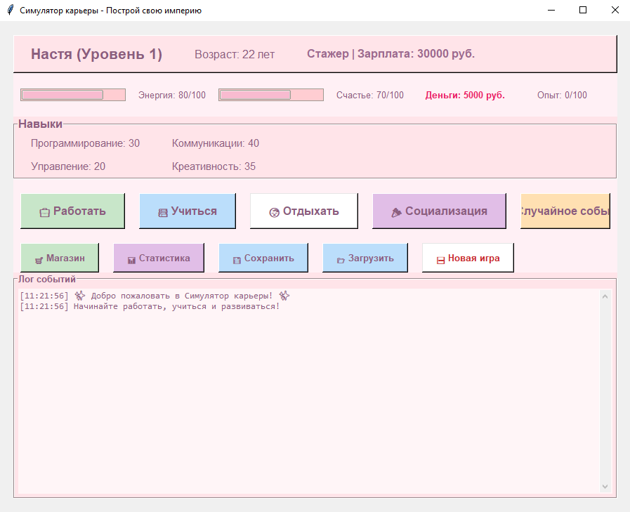
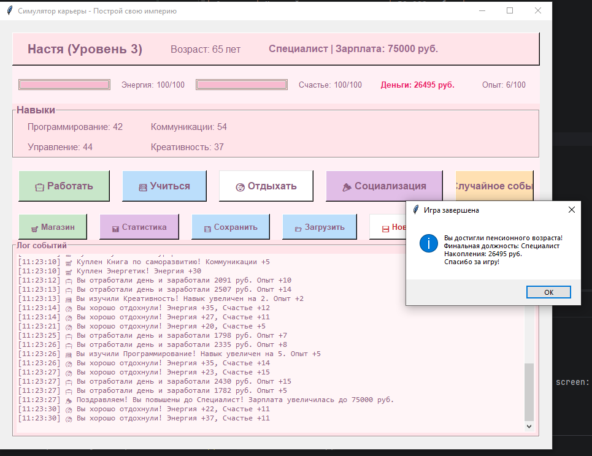
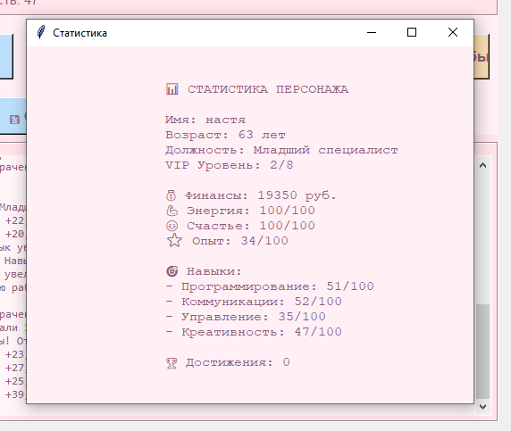

# Отчет по Лабораторной работе №8

## Симулятор карьеры - Построй свою империю

## Описание игры

**Симулятор карьеры** - это увлекательная экономическая RPG-игра, где вы управляете жизнью и карьерой персонажа. Начинайте с должности стажера и продвигайтесь по карьерной лестнице вплоть до CEO, развивая навыки, зарабатывая деньги и балансируя между работой, учебой и отдыхом.

### Особенности игры:
- 8 карьерных уровней от Стажера до CEO
- 4 развиваемых навыка (Программирование, Коммуникации, Управление, Креативность)
- Случайные события, влияющие на игровой процесс
- Магазин с полезными предметами
- Система сохранения и загрузки игры
- Детальная статистика персонажа
- Красочный GUI на Tkinter

## Как играть

### Основные действия:
- **Работать** - зарабатывайте деньги и опыт
- **Учиться** - повышайте свои навыки
- **Отдыхать** - восстанавливайте энергию
- **Социализация** - повышайте уровень счастья
- **Случайное событие** - получайте неожиданные бонусы или штрафы
- **Магазин** - покупайте полезные предметы

### Цель игры:
Достичь максимального карьерного уровня (CEO) до достижения пенсионного возраста (65 лет), поддерживая высокие показатели энергии, счастья и финансового благополучия.

## Инструкции по запуску

### Требования:
- Python 3.7 или выше
- Tkinter (обычно входит в стандартную установку Python)

### Установка и запуск:

1. **Скачайте или скопируйте код** в файл `career_simulator.py`

2. **Убедитесь, что Python установлен:**
   ```bash
   python --version
   ```
3. **Запустите игру:**
    ```bash
    python career_simulator.py
    ```
## Система сохранений:

- Игра автоматически создает файл savegame.json при сохранении
- Используйте кнопки сохранить и загрузить для управления сохранениями
- Файл сохранения хранится в той же папке, что и игра

## Краткая справка:
### Показатели персонажа:

| Показатель     | Влияние                  | Как повысить                                                   |
|----------------|--------------------------|----------------------------------------------------------------|
| энергия        | Влияет на возможность работы и учебы      | Отдых, энергетики из магазина |
| счастье        | Влияет на эффективность работы          | Социализация, отдых, положительные события                    |
| опыт           | Определяет повышение по службе         | Работа, учеба, события                      |
| навыки         | Влияют на доход и успех | Учеба, курсы из магазина                    |

### Карьерная лестница:

| Уровень | Должность                            | Зарплата     |
|---------|--------------------------------------|--------------|
| 1       | Стажер | 30,000 руб.  |
| 2       | Младший специалист       | 50,000 руб.  |
| 3       | Специалист       | 75,000 руб.  |
| 4       | Старший специалист              | 100,000 руб. |
| 5       | Team Lead | 150,000 руб. |
| 6       | Project Manager       | 200,000 руб. |
| 7       | Director       | 300,000 руб. |
| 8       | CEO              | 500,000 руб. |

## Описание программы:

Код построен вокруг главного класса CareerSimulator, который содержит всю логику игры. Используется объектно-ориентированный подход - все данные и методы инкапсулированы внутри класса.

```python
class CareerSimulator:
    def __init__(self, root):  # Конструктор - вызывается при создании объекта
        self.root = root        # Сохраняем главное окно Tkinter
```

Импорт библиотек и структура

```python
import tkinter as tk                    # Главная GUI библиотека
from tkinter import ttk, messagebox    # ttk - стилизованные виджеты, messagebox - диалоговые окна
import random                           # Для генерации случайных событий
import json                             # Для сохранения/загрузки (сериализация данных)
import os                               # Для проверки существования файлов
from datetime import datetime           # Для временных меток в логе
```

Почему они нужны:

- tkinter - создает окна, кнопки, поля ввода

- random - делает игру непредсказуемой

- json - превращает словари Python в текст и обратно

- os - проверяет, существует ли файл сохранения

- datetime - добавляет время к сообщениям в лог

Конструктор класса (init)
Это самая большая часть, где всё настраивается.

1. Настройка окна
```python
self.root.title("Симулятор карьеры - Построй свою империю")
self.root.geometry("900x700")           # Размер окна: ширина 900, высота 700
self.root.resizable(True, True)         # Можно изменять размер окна
self.root.configure(bg='#2c3e50')       # Фоновый цвет (темно-синий)
```
2. Переменные игры (состояние персонажа)
```python
self.player_name = ""           # Имя персонажа (заполнится позже)
self.age = 22                   # Начальный возраст
self.energy = 80                # Энергия (0-100), влияет на работу
self.happiness = 70             # Счастье (0-100), влияет на эффективность
```
Словарь навыков:

```python
self.skills = {
    "Программирование": 30,    # Каждый навык 0-100
    "Коммуникации": 40,
    "Управление": 20,
    "Креативность": 35
}
```
Почему словарь? Легко обращаться по имени: self.skills["Программирование"]

3. Карьерная лестница (вложенный словарь)
```python
self.career_paths = {
    1: {"title": "Стажер", "salary": 30000},
    2: {"title": "Младший специалист", "salary": 50000},
    # ... до 8 уровня
}
```
Структура: ключ - уровень (int), значение - словарь с названием и зарплатой.

Создание GUI (метод setup_gui)
Фреймы - контейнеры для виджетов
```python
main_frame = tk.Frame(self.root, bg='#2c3e50')
main_frame.pack(fill=tk.BOTH, expand=True, padx=20, pady=20)
```
- fill=tk.BOTH - растягивается в обе стороны

- expand=True - занимает всё свободное пространство

- padx=20, pady=20 - отступы 20 пикселей

Информационная панель
```python
info_frame = tk.Frame(main_frame, bg='#34495e', relief=tk.RAISED, bd=2)
relief=tk.RAISED - эффект "приподнятой" рамки
```
- bd=2 - толщина границы

Label (текстовые метки):

```python
self.name_label = tk.Label(info_frame, text="", font=('Arial', 16, 'bold'), 
                           fg='#ecf0f1', bg='#34495e')
```
- fg (foreground) - цвет текста

- bg (background) - цвет фона

- font - шрифт и размер

Progressbar (полоски прогресса)
```python
self.energy_bar = ttk.Progressbar(stats_frame, length=150, mode='determinate')
length=150 - ширина в пикселях
```
mode='determinate' - стандартный режим (от 0 до максимума)

Как работают:

```python
self.energy_bar['value'] = self.energy  # Устанавливаем текущее значение
self.energy_bar['maximum'] = 100        # Устанавливаем максимум
```
Методы обновления и логирования

update_display() - обновляет весь интерфейс
```python
def update_display(self):
    # Обновление текста
    self.name_label.config(text=f"{self.player_name} (Уровень {self.career_level})")
    
    # Обновление прогресс-баров
    self.energy_bar['value'] = self.energy
    self.energy_bar['maximum'] = 100
```
Обратите внимание на config() - это метод изменения свойств виджета.

Проверка повышения
```python
if self.experience >= 100 and self.career_level < 8:
    self.experience -= 100      # Опыт уменьшается (как уровень в RPG)
    self.career_level += 1
    self.job_title = self.career_paths[self.career_level]["title"]
    self.salary = self.career_paths[self.career_level]["salary"]
```
add_log() - добавление сообщений в лог
```python
def add_log(self, message):
    timestamp = datetime.now().strftime("%H:%M:%S")  # Текущее время как строка
    self.log_text.insert(tk.END, f"[{timestamp}] {message}\n")  # В конец текста
    self.log_text.see(tk.END)  # Автопрокрутка вниз
```
Основные игровые действия

Метод work() - работа
```python
def work(self):
    if self.energy < 20:  # Проверка энергии
        self.add_log("❌ Вы слишком устали для работы!")
        return  # Выход из метода (не выполняем остальное)
    
    # Расчет дохода
    base_income = self.salary // 30  # Целочисленное деление
    skill_bonus = sum(self.skills.values()) // 200  # Сумма всех навыков / 200
    income = base_income + skill_bonus + random.randint(0, 1000)
```
Интересный момент:

```python
skill_bonus = sum(self.skills.values()) // 200
sum(self.skills.values()) - складывает все значения навыков (30+40+20+35=125)
// 200 - целочисленное деление (125//200 = 0, так как меньше 200)
```
Метод study() - учеба
```python
skill = random.choice(list(self.skills.keys()))  # Выбираем случайный навык
increase = random.randint(2, 8)  # Случайное число от 2 до 8
self.skills[skill] = min(100, self.skills[skill] + increase)  # Не больше 100
```
min(100, ...) - ограничивает максимальное значение 100

Случайные события
```python
events = [
    {"text": "🎁 Вы нашли кошелек!", "money": 1000, "happiness": 10},
    {"text": "💻 Компьютер сломался!", "money": -3000, "happiness": -15},
    # ...
]
```
Каждое событие - словарь с разными ключами. Метод проверяет, какие ключи есть:

```python
if "money" in event:  # Проверка наличия ключа в словаре
    self.money += event["money"]
if "skill" in event:
    self.skills[event["skill"]] = min(100, self.skills[event["skill"]] + event["skill_gain"])
```
Магазин (отдельное окно)
```python
def open_shop(self):
    shop_window = tk.Toplevel(self.root)  # Создаем новое окно
    shop_window.title("Магазин")
    shop_window.geometry("400x500")
```
Важно: Toplevel() создает дочернее окно, которое не блокирует главное.

lambda в кнопках
```python
buy_btn = tk.Button(frame, text="Купить", 
                   command=lambda i=item_name, inf=item_info: self.buy_item(i, inf, shop_window))
```
Проблема: если написать command=self.buy_item(item_name, item_info, shop_window), функция выполнится сразу при создании кнопки.

Решение: lambda создает анонимную функцию, которая запоминает значения item_name и item_info и вызывает buy_item только при нажатии.

Сохранение и загрузка (JSON)
Сохранение
```python
def save_game(self):
    save_data = {
        "player_name": self.player_name,
        "age": self.age,
        "skills": self.skills,  # Словарь сохраняется целиком
        # ...
    }
    
    with open("savegame.json", "w", encoding="utf-8") as f:
        json.dump(save_data, f, ensure_ascii=False, indent=4)
```
Что делает JSON:

- Превращает словарь Python в текст: {"player_name": "Анна", "age": 22}

- indent=4 - делает текст красивым (с отступами)

- ensure_ascii=False - позволяет сохранять русские буквы

Загрузка
```python
def load_game(self):
    if os.path.exists("savegame.json"):  # Проверяем, есть ли файл
        with open("savegame.json", "r", encoding="utf-8") as f:
            save_data = json.load(f)    # Превращаем текст обратно в словарь
        
        self.player_name = save_data.get("player_name", "Игрок")  # Если ключа нет - значение по умолчанию
```
Новая игра и ввод имени

get_player_name() - сложное окно с ожиданием
```python
def get_player_name(self):
    name_window = tk.Toplevel(self.root)
    # ... создаем поле ввода и кнопку
    
    result = ["Игрок"]  # Список-контейнер (чтобы можно было изменить внутри функции)
    
    def confirm():
        name = name_entry.get().strip()
        if name:
            result[0] = name
        name_window.destroy()
    
    # ...
    self.root.wait_window(name_window)  # Ждем закрытия окна (блокирует выполнение)
    return result[0]
```
Ключевые концепции Tkinter

Менеджеры геометрии

pack() - простой, упаковывает виджеты друг за другом

```python
button.pack(side=tk.LEFT, padx=10)  # Прижимает к левому краю
```
grid() - таблица (ряды и колонки)

```python
label.grid(row=0, column=0, padx=20, pady=5)
```
Цвета (формат hex)
- "#FFF0F5", Нежно-розовый
- "#FFE4E9", Светло-розовый для фреймов
- "#8B5E7E", Темно-розовый для текста
- "#FFFFFF", Белый для текста на кнопках
- "#C8E6C9", Нежно-зеленый
- "#BBDEFB", Нежно-голубой
- "#FFFFFF", Белый
- "#E1BEE7", Нежно-фиолетовый для разнообразия
- "#FFE0B2", Нежно-оранжевый
- "#FFCDD2", Светло-розовый для прогресс-баров
- "#FFF5F7", Очень светлый розовый для лога

События

Клик по кнопке вызывает функцию, указанную в command:

```python
tk.Button(text="Нажми", command=self.my_function)
```
Поток выполнения игры

Запуск: main() → root = tk.Tk() → app = CareerSimulator(root) → root.mainloop()

Инициализация: Вызывается __init__, который запускает setup_gui()

Цикл событий: mainloop() ждет действий пользователя

Действие: Пользователь нажимает кнопку → Вызывается соответствующий метод → Обновляются данные → update_display() → Цикл продолжается

Важные детали

Проверка границ
```python
self.energy = max(0, min(100, self.energy + change))
max(0, ...) - не меньше 0, min(100, ...) - не больше 100
```
Случайные числа
```python
random.randint(5, 15)  # Целое число от 5 до 15 включительно
random.choice(list)     # Случайный элемент из списка
```
messagebox - диалоговые окна
```python
messagebox.showinfo("Заголовок", "Текст")
messagebox.askyesno("Вопрос", "Текст вопроса")  # Возвращает True/False
messagebox.showerror("Ошибка", "Текст ошибки")
```

## Вывод:
до:

после игры:

статистика:



