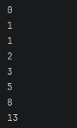
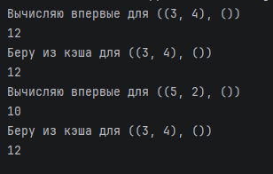

# Замыкания
## Задание 1
## 1. Условие:
Замыкание реализующее последовательность Фибоначчи.
## 2. Описание проделанной работы:
Создаем внешнюю функцию, которая создаёт замыкание для генерации чисел Фибоначчи, потом внутреннюю функцию — замыкание, которой помнит a и b, где говорим, что a и b не локальные переменные, далее возвращаем функцию, а не её результат и затем уже создаём замыкание.
## 3. Программа
```python
def fibonacci_closure():
    a = 0
    b = 1

    def get_next():
        nonlocal a, b
        result = a
        a, b = b, a + b
        return result

    return get_next

fib = fibonacci_closure()

print(fib())
print(fib())
print(fib())
print(fib())
print(fib())
print(fib())
print(fib())
print(fib())
```
## 4. Вывод


---

## Задание 2
## 1. Условие:
Декоратор для кэширования результатов выполнения функций.
## 2. Описание проделанной работы:

Данная программа реализует декоратор cache_decorator, который является классическим примером замыкания: внешняя функция создает словарь memory, а внутренняя функция wrapper запоминает (замыкает) этот словарь и использует его для кэширования результатов вызовов декорируемой функции slow_multiply. При каждом вызове wrapper формирует ключ из переданных аргументов и проверяет, есть ли уже вычисленное значение в memory — если есть, программа мгновенно возвращает результат из кэша (что видно по сообщению "Беру из кэша"), если нет — выполняет оригинальную функцию (с имитацией долгих вычислений через time.sleep(2)), сохраняет результат в кэш и возвращает его. Благодаря этому повторные вызовы slow_multiply(3, 4) после первого вычисления происходят без задержки, в то время как вызов с новыми аргументами (5, 2) выполняется заново. Таким образом, замыкание позволяет сохранять состояние (словарь с результатами) между разными вызовами функции, что даёт эффект мемоизации и оптимизации повторных вычислений.

## 3. Программа
```python
def cache_decorator(func):
    memory = {}

    def wrapper(*args, **kwargs):
        key = (args, tuple(sorted(kwargs.items())))

        if key in memory:
            print(f"Беру из кэша для {key}")
            return memory[key]

        print(f"Вычисляю впервые для {key}")
        result = func(*args, **kwargs)

        key = (args, tuple(sorted(kwargs.items())))  
        if key in memory:
            print(f"Беру из кэша для {key}")
            return memory[key]  
        print(f"Вычисляю впервые для {key}")
        result = func(*args, **kwargs)
        memory[key] = result

        return result

    return wrapper


@cache_decorator
def slow_multiply(x, y):
    import time
    time.sleep(2)


@cache_decorator
def slow_multiply(x, y):
    import time
    time.sleep(2)
    return x * y


print(slow_multiply(3, 4))
print(slow_multiply(3, 4))
print(slow_multiply(5, 2))
print(slow_multiply(3, 4))
```
## 4. Вывод

---
