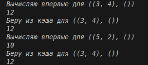

# Замыкания
## Задание 1
## 1. Условие:
Замыкание реализующее последовательность Фибоначчи.
## 2. Описание проделанной работы:
Создаем внешнюю функцию, которая создаёт замыкание для генерации чисел Фибоначчи, потом внутреннюю функцию — замыкание, которой помнит a и b, где говорим, что a и b не локальные переменные, далее возвращаем функцию, а не её результат и затем уже создаём замыкание.
## 3. Программа
```python
def fibonacci_closure():
    a = 0
    b = 1

    def get_next():
        nonlocal a, b
        result = a
        a, b = b, a + b
        return result

    return get_next

fib = fibonacci_closure()

print(fib())
print(fib())
print(fib())
print(fib())
print(fib())
print(fib())
print(fib())
print(fib())
```
## 4. Вывод


---

## Задание 2
## 1. Условие:
Декоратор для кэширования результатов выполнения функций.
## 2. Описание проделанной работы:
- Создаем словарь для хранения результатов. Этот словарь будет жить, пока существует функция
- Превращаем аргументы в ключ для словаря
- - Словарь: ключ -> результат
- - Кортеж - неизменяемый тип
- - Возвращаем сохраненный результат
- - Если нет - вызываем оригинальную функцию
- - Вызываем исходную функцию
- Сохраняем результат в кэш
- Возвращаем обертку, которая заменит исходную функцию
- Используем декоратор
- Проверяем работу
## 3. Программа
```python
def cache_decorator(func):
    memory = {}

    def wrapper(*args, **kwargs):
        key = (args, tuple(sorted(kwargs.items())))  
        if key in memory:
            print(f"Беру из кэша для {key}")
            return memory[key]  
        print(f"Вычисляю впервые для {key}")
        result = func(*args, **kwargs)  
        memory[key] = result

        return result

    return wrapper


@cache_decorator
def slow_multiply(x, y):
    import time
    time.sleep(2)  
    return x * y


print(slow_multiply(3, 4))
print(slow_multiply(3, 4))
print(slow_multiply(5, 2))
print(slow_multiply(3, 4))
```
## 4. Вывод
